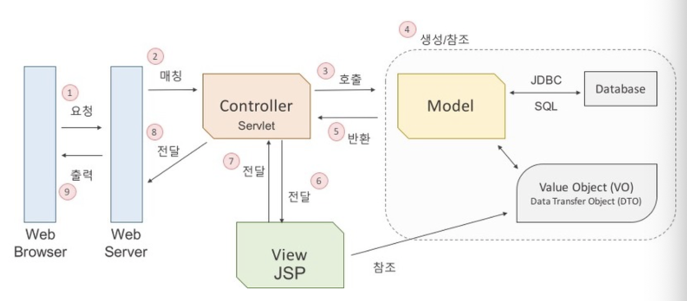

# MVC

> django의 MTV(model, template, view)와 같다. 이름만 다르고 수행 역할은 똑같다.

### Model

 컨트롤러가 호출 할 때 요청에 맞는 역할을 수행한다. 데이터를 처리하는 part이다. DB에 연결하고 데이터를 추출하거나 저장, 삭제, 수정, 변환 등 작업을 수행한다. 

### View

 컨트롤러부터 받을 모델의 결과값을 가지고 출력할 화면을 만드는 일을 한다.

### Controller

 조정자. 클라이언트의 요청을 받았을 때, 그 요청에 대해 실제 업무를 수행하는 컴포넌트를 호출한다. 데이터가 있다면 모델에 전달하기 쉽게 데이터를 가공한다. task를 마치면 결과를 view에 전달한다.

> 출처 : https://asfirstalways.tistory.com/180