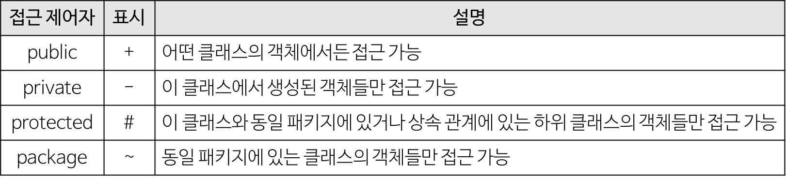
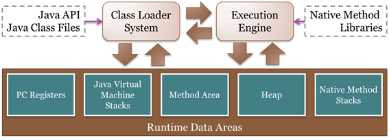
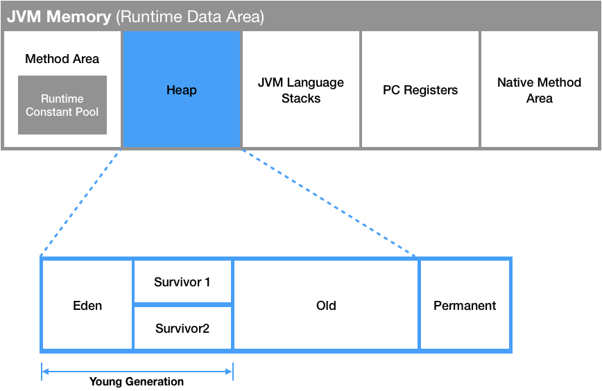
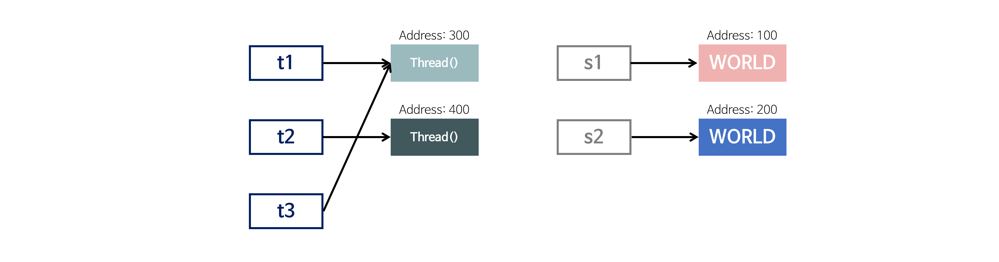

#  Java

**📖 Contents**

- \7. Java
  - [java 프로그래밍이란](https://github.com/WeareSoft/tech-interview/blob/master/contents/java.md#java-프로그래밍이란)
  - [Java SE와 Java EE 애플리케이션 차이](https://github.com/WeareSoft/tech-interview/blob/master/contents/java.md#java-se와-java-ee-애플리케이션-차이)
  - [java와 c/c++의 차이점](https://github.com/WeareSoft/tech-interview/blob/master/contents/java.md#java와-cc의-차이점)
  - [java 언어의 장단점](https://github.com/WeareSoft/tech-interview/blob/master/contents/java.md#java-언어의-장단점)
  - [java의 접근 제어자의 종류와 특징](https://github.com/WeareSoft/tech-interview/blob/master/contents/java.md#java의-접근-제어자의-종류와-특징)
  - [java의 데이터 타입](https://github.com/WeareSoft/tech-interview/blob/master/contents/java.md#java의-데이터-타입)
  - Wrapper class
    - [자바에서 제공하는 Wrapper class](https://github.com/WeareSoft/tech-interview/blob/master/contents/java.md#자바에서-제공하는-wrapper-class)
    - [박싱(Boxing), 언박싱(Unboxing)](https://github.com/WeareSoft/tech-interview/blob/master/contents/java.md#박싱boxing-언박싱unboxing)
    - [오토 박싱(AutoBoxing)과 오토 언박싱(AutoUnBoxing)](https://github.com/WeareSoft/tech-interview/blob/master/contents/java.md#오토-박싱autoboxing과-오토-언박싱autounboxing)
  - [OOP의 4가지 특징](https://github.com/WeareSoft/tech-interview/blob/master/contents/java.md#oop의-4가지-특징)
  - [OOP의 5대 원칙](https://github.com/WeareSoft/tech-interview/blob/master/contents/java.md#oop의-5대-원칙)
  - [객체지향 프로그래밍과 절차지향 프로그래밍의 차이](https://github.com/WeareSoft/tech-interview/blob/master/contents/java.md#객체지향-프로그래밍과-절차지향-프로그래밍의-차이)
  - 객체지향이란
    - [객체지향의 장점(강점)](https://github.com/WeareSoft/tech-interview/blob/master/contents/java.md#객체지향의-장점강점)
    - [객체지향의 단점(한계)](https://github.com/WeareSoft/tech-interview/blob/master/contents/java.md#객체지향의-단점한계)
    - [객체지향적 설계원칙 SOLID](https://github.com/WeareSoft/tech-interview/blob/master/contents/java.md#객체지향적-설계원칙-solid)
    - [객체지향의 특징](https://github.com/WeareSoft/tech-interview/blob/master/contents/java.md#객체지향의-특징)
  - [java의 non-static 멤버와 static 멤버의 차이](https://github.com/WeareSoft/tech-interview/blob/master/contents/java.md#java의-non-static-멤버와-static-멤버의-차이)
  - [❓java의 main 메서드가 static인 이유](https://github.com/WeareSoft/tech-interview/blob/master/contents/java.md#questionjava의-main-메서드가-static인-이유)
  - [java의 final 키워드](https://github.com/WeareSoft/tech-interview/blob/master/contents/java.md#java의-final-키워드)
  - [java의 제네릭과 c++의 템플릿의 차이](https://github.com/WeareSoft/tech-interview/blob/master/contents/java.md#java의-제네릭과-c의-템플릿의-차이)
  - java의 가비지 컬렉션 처리 방법
    - [java9의 default GC](https://github.com/WeareSoft/tech-interview/blob/master/contents/java.md#java9의-default-gc)
  - [java 직렬화와 역직렬화란 무엇인가](https://github.com/WeareSoft/tech-interview/blob/master/contents/java.md#java-직렬화와-역직렬화란-무엇인가)
  - [클래스 객체 인스턴스의 차이](https://github.com/WeareSoft/tech-interview/blob/master/contents/java.md#클래스-객체-인스턴스의-차이)
  - [객체란 무엇인가](https://github.com/WeareSoft/tech-interview/blob/master/contents/java.md#객체란-무엇인가)
  - [오버로딩과 오버라이딩의 차이](https://github.com/WeareSoft/tech-interview/blob/master/contents/java.md#오버로딩과-오버라이딩의-차이)
  - [Call by Reference와 Call by Value의 차이](https://github.com/WeareSoft/tech-interview/blob/master/contents/java.md#call-by-reference와-call-by-value의-차이)
  - [인터페이스와 추상 클래스의 차이](https://github.com/WeareSoft/tech-interview/blob/master/contents/java.md#인터페이스와-추상-클래스의-차이)
  - [JVM 구조](https://github.com/WeareSoft/tech-interview/blob/master/contents/java.md#jvm-구조)
  - [Java Collections Framework](https://github.com/WeareSoft/tech-interview/blob/master/contents/java.md#java-collections-framework)
  - [java Map 인터페이스 구현체의 종류](https://github.com/WeareSoft/tech-interview/blob/master/contents/java.md#java-map-인터페이스-구현체의-종류)
  - [java Set 인터페이스 구현체의 종류](https://github.com/WeareSoft/tech-interview/blob/master/contents/java.md#java-set-인터페이스-구현체의-종류)
  - [java List 인터페이스 구현체의 종류](https://github.com/WeareSoft/tech-interview/blob/master/contents/java.md#java-list-인터페이스-구현체의-종류)
  - [Annotation](https://github.com/WeareSoft/tech-interview/blob/master/contents/java.md#annotation)
  - [String StringBuilder StringBuffer](https://github.com/WeareSoft/tech-interview/blob/master/contents/java.md#string-stringbuilder-stringbuffer)
  - [동기화와 비동기화의 차이](https://github.com/WeareSoft/tech-interview/blob/master/contents/java.md#동기화와-비동기화의-차이)
  - [java에서 ==와 equals()의 차이](https://github.com/WeareSoft/tech-interview/blob/master/contents/java.md#java에서-와-equals의-차이)
  - [java의 리플렉션 이란](https://github.com/WeareSoft/tech-interview/blob/master/contents/java.md#java의-리플렉션-이란)
  - [Stream이란](https://github.com/WeareSoft/tech-interview/blob/master/contents/java.md#stream이란)
  - [Lambda란](https://github.com/WeareSoft/tech-interview/blob/master/contents/java.md#lambda란)
  - [Reference](https://github.com/WeareSoft/tech-interview/blob/master/contents/java.md#reference)
  - [🏠 Home](https://github.com/WeareSoft/tech-interview/blob/master/contents/java.md#house-home)

------

### java 프로그래밍이란

> ⏫[Top](https://github.com/WeareSoft/tech-interview/blob/master/contents/java.md#7-java) ↩️[Back](https://github.com/WeareSoft/tech-interview#7-java) ℹ️[Home](https://github.com/WeareSoft/tech-interview#tech-interview)
>
> - 

### Java SE와 Java EE 애플리케이션 차이

> ⏫[Top](https://github.com/WeareSoft/tech-interview/blob/master/contents/java.md#7-java) ↩️[Back](https://github.com/WeareSoft/tech-interview#7-java) ℹ️[Home](https://github.com/WeareSoft/tech-interview#tech-interview)
>
> - https://www.ibm.com/support/knowledgecenter/ko/SSQP76_8.9.1/com.ibm.odm.dserver.rules.res.managing/topics/con_javase_javaee_applis.html

### java와 c/c++의 차이점

- java와 c/c++의 가장 큰 차이점은 실행 환경이다.
- java에서의 개발: 컴파일 혹은 컴파일 + jar압축
  - 자바는 링크 과정이 없이 컴파일러가 바로 바이트 코드를 생성
- c/c++에서의 개발: 컴파일 + 링크

> ⏫[Top](https://github.com/WeareSoft/tech-interview/blob/master/contents/java.md#7-java) ↩️[Back](https://github.com/WeareSoft/tech-interview#7-java) ℹ️[Home](https://github.com/WeareSoft/tech-interview#tech-interview)

### java 언어의 장단점

- 장점
  - 운영체제에 독립적이다.
    - JVM에서 동작하기 때문에, 특정 운영체제에 종속되지 않는다.
  - 객체지향 언어이다.
    - 객체지향적으로 프로그래밍 하기 위해 여러 언어적 지원을 하고있다. (캡슐화, 상속, 추상화, 다형성 등)
    - 객체지향 패러다임의 특성상 비교적 이해하고 배우기 쉽다.
  - 자동으로 메모리 관리를 해준다.
    - JVM에서 Garbage Collector라고 불리는 데몬 쓰레드에 의해 GC(Garbage Collection)가 일어난다. GC로 인해 별도의 메모리 관리가 필요 없으며 비지니스 로직에 집중할 수 있다. [(참고)](http://www.jpstory.net/2013/12/15/garbage-collection-in-java/)
  - 오픈소스이다.
    - 정확히 말하면 OpenJDK가 오픈소스이다. OracleJDK는 사용 목적에 따라서 유료가 될 수 있다.
      - OracleJDK의 유료화 이슈는 다음을 참고. [(참고)](https://okky.kr/article/490213)
    - 많은 Java 개발자가 존재하고 생태계가 잘 구축되어있다. 덕분에 오픈소스 라이브러리가 풍부하며 잘 활용한다면 짧은 개발 시간 내에 안정적인 애플리케이션을 쉽게 구현할 수 있다.
  - 멀티스레드를 쉽게 구현할 수 있다.
    - 자바는 스레드 생성 및 제어와 관련된 라이브러리 API를 제공하고 있기 때문에 실행되는 운영체제에 상관없이 멀티 스레드를 쉽게 구현할 수 있다.
  - 동적 로딩(Dynamic Loading)을 지원한다
    - 애플리케이션이 실행될 때 모든 객체가 생성되지 않고, 각 객체가 필요한 시점에 클래스를 동적 로딩해서 생성한다. 또한 유지보수 시 해당 클래스만 수정하면 되기 때문에 전체 애플리케이션을 다시 컴파일할 필요가 없다. 따라서 유지보수가 쉽고 빠르다.
- 단점
  - 비교적 속도가 느리다.
    - 자바는 한 번의 컴파일링으로 실행 가능한 기계어가 만들어지지 않고 JVM에 의해 기계어로 번역되고 실행하는 과정을 거치기 때문에 C나 C++의 컴파일 단계에서 만들어지는 완전한 기계어보다는 속도가 느리다. 그러나 하드웨어의 성능 향상과 바이트 코드를 기계어로 변환해주는 JIT 컴파일러 같은 기술 적용으로 JVM의 기능이 향상되어 속도의 격차가 많이 줄어들었다.
  - 예외처리가 불편하다.
    - 프로그래머 검사가 필요한 예외가 등장한다면 무조건 프로그래머가 선언을 해줘야 한다.

> ⏫[Top](https://github.com/WeareSoft/tech-interview/blob/master/contents/java.md#7-java) ↩️[Back](https://github.com/WeareSoft/tech-interview#7-java) ℹ️[Home](https://github.com/WeareSoft/tech-interview#tech-interview)
>
> - http://yolojeb.tistory.com/17
> - http://huhghiza.tistory.com/7

### java의 접근 제어자의 종류와 특징

[](https://github.com/WeareSoft/tech-interview/blob/master/contents/images/access-controller.png)

> ⏫[Top](https://github.com/WeareSoft/tech-interview/blob/master/contents/java.md#7-java) ↩️[Back](https://github.com/WeareSoft/tech-interview#7-java) ℹ️[Home](https://github.com/WeareSoft/tech-interview#tech-interview)

### java의 데이터 타입

1. 기본 데이터 타입(Primitive Data Type)
   - 기본 타입의 종류는 byte, short, char, int, float, double, boolean이 있다.
     - 정수형 : byte, short, int, long
     - 실수형 : float, double
     - 논리형 : boolean(ture/false)
     - 문자형 : char
   - 기본 타입의 크기가 작고 고정적이기 때문에 메모리의 **Stack** 영역에 저장된다.
2. 참조 타입(Reference Data Type)
   - 참조 타입의 종류는 class, array, interface, Enumeration이 있다.
     - 기본형을 제외하고는 모두 참조형이다.
     - new 키워드를 이용하여 객체를 생성하여 데이터가 생성된 주소를 참조하는 타입이다.
     - String, StringBuffer, List, 개인이 만든 클래스 등
     - String과 배열은 참조 타입과 달리 new 없이 생성이 가능하지만 기본 타입이 아닌 참조 타입이다.
   - 참조 타입의 데이터의 크기가 가변적, 동적이기 때문에 동적으로 관리되는 **Heap** 영역에 저장된다.
   - 더 이상 참조하는 변수가 없을 때 가비지 컬렉션에 의해 파괴된다.
   - 참조 타입은 값이 저장된 곳의 주소를 저장하는 공간으로 객체의 주소를 저장한다. (Call-By-Value)

> ⏫[Top](https://github.com/WeareSoft/tech-interview/blob/master/contents/java.md#7-java) ↩️[Back](https://github.com/WeareSoft/tech-interview#7-java) ℹ️[Home](https://github.com/WeareSoft/tech-interview#tech-interview)
>
> - [http://robyncloud.tistory.com/entry/](http://robyncloud.tistory.com/entry/자바에서-꼭-이해해야-되는개념-1메모리-객체-참조변수)
> - https://m.blog.naver.com/PostView.nhn?blogId=roropoly1&logNo=220649338545&proxyReferer=https%3A%2F%2Fwww.google.co.kr%2F

### Wrapper class

프로그램에 따라 기본 타입의 데이터를 객체로 취급해야 하는 경우가 있다. 예를 들어, 메소드의 인수로 객체 타입만이 요구되면, 기본 타입의 데이터를 그대로 사용할 수는 없다. 이때 기본 타입의 데이터를 먼저 객체로 변환한 후 작업을 수행해야 한다.

#### 자바에서 제공하는 Wrapper class

| 기본 타입 | 래퍼 클래스 |
| --------- | ----------- |
| `byte`    | `Byte`      |
| `short`   | `Short`     |
| `int`     | `Integer`   |
| `long`    | `Long`      |
| `float`   | `Float`     |
| `double`  | `Double`    |
| `char`    | `Character` |
| `boolean` | `Boolean`   |

이렇게 8개의 기본 타입에 해당하는 데이터를 객체로 포장해 주는 클래스를 래퍼 클래스(Wrapper class)라고 한다. 래퍼 클래스는 각각의 타입에 해당하는 데이터를 인수로 전달받아, 해당 값을 가지는 객체로 만들어 준다. 이러한 래퍼 클래스는 모두 java.lang 패키지에 포함되어 제공된다.

#### 박싱(Boxing), 언박싱(Unboxing)

래퍼 클래스(Wrapper class)는 산술 연산을 위해 정의된 클래스가 아니므로, 인스턴스에 저장된 값을 변경할 수 없다. 단지, 값을 참조하기 위해 새로운 인스턴스를 생성하고, 생성된 인스턴스의 값만을 참조할 수 있다.

[](https://github.com/WeareSoft/tech-interview/blob/master/contents/images/java_boxing_unboxing.png)

위의 그림과 같이 기본 타입의 데이터를 래퍼 클래스의 인스턴스로 변환하는 과정을 박싱(Boxing), 래퍼 클래스의 인스턴스에 저장된 값을 다시 기본 타입의 데이터로 꺼내는 과정을 언박싱(UnBoxing)이라고 한다.

#### 오토 박싱(AutoBoxing)과 오토 언박싱(AutoUnBoxing)

JDK 1.5부터는 박싱과 언박싱이 필요한 상황에서 자바 컴파일러가 이를 자동으로 처리해 준다. 이렇게 자동화된 박싱과 언박싱을 오토 박싱(AutoBoxing)과 오토 언박싱(AutoUnBoxing)이라고 부른다.

```
Integer num = new Integer(17); // 박싱
int n = num.intValue();        // 언박싱
System.out.println(n); // 출력 값: 17


Character ch = 'X'; // Character ch = new Character('X'); : 오토박싱
char c = ch;        // char c = ch.charValue();           : 오토언박싱
System.out.println(c); // 출력 값: X
17
X
```

오토 박싱을 이용하면 `new` 키워드를 사용하지 않고도 자동으로 `Character` 인스턴스를 생성할 수 있다. 반대로 `charValue()` 메소드를 사용하지 않고도, 오토 언박싱을 이용하여 인스턴스에 저장된 값을 바로 참조할 수 있다.

```
public class Wrapper02 {
    public static void main(String[] args) {
        Integer num1 = new Integer(7); // 박싱
        Integer num2 = new Integer(3); // 박싱

        int int1 = num1.intValue();    // 언박싱
        int int2 = num2.intValue();    // 언박싱

        Integer result1 = num1 + num2; // 10 
        Integer result2 = int1 - int2; // 4
        int result3 = num1 * int2;     // 21
    }
}
public class Wrapper03 {
    public static void main(String[] args) {
      Integer num1 = new Integer(10);
      Integer num2 = new Integer(20);
      Integer num3 = new Integer(10);

      System.out.println(num1 < num2);       // true
      System.out.println(num1 == num3);      // false
      System.out.println(num1.equals(num3)); // true
    }
}
```

래퍼 클래스의 비교 연산도 오토언박싱을 통해 가능해지지만, 인스턴스에 저장된 값의 동등 여부 판단은 비교 연산자인 동등 연산자(`==`)를 사용해서는 안 되며, `equals()` 메소드를 사용해야만 한다.

래퍼 클래스도 객체이므로 동등 연산자(`==`)를 사용하게 되면, 두 인스턴스의 값을 비교하는 것이 아니라 두 인스턴스의 주소값을 비교한다.

따라서 서로 다른 두 인스턴스를 동등 연산자(`==`)로 비교하게 되면, 언제나 `false` 값을 반환한다.

그러므로 인스턴스에 저장된 값의 동등 여부를 정확히 판단하려면 `equals()` 메소드를 사용해야한다.

> ⏫[Top](https://github.com/WeareSoft/tech-interview/blob/master/contents/java.md#7-java) ↩️[Back](https://github.com/WeareSoft/tech-interview#7-java) ℹ️[Home](https://github.com/WeareSoft/tech-interview#tech-interview)
>
> - 

### OOP의 4가지 특징

1. 추상화(Abstraction)
   - 구체적인 사물들의 공통적인 특징을 파악해서 이를 하나의 개념(집합)으로 다루는 것
2. 캡슐화(Encapsulation)
   - 정보 은닉(information hiding): 필요가 없는 정보는 외부에서 접근하지 못하도록 제한하는 것
   - 높은 응집도, 낮은 결합도를 유지하여 유연함과 유지보수성 증가
3. 일반화 관계(Inheritance, 상속)
   - 여러 개체들이 가진 공통된 특성을 부각시켜 하나의 개념이나 법칙으로 성립시키는 과정
4. 다형성(Polymorphism)
   - 서로 다른 클래스의 객체가 같은 메시지를 받았을 때 각자의 방식으로 동작하는 능력
   - 오버라이딩(Overriding), 오버로딩(Overloading)

> ⏫[Top](https://github.com/WeareSoft/tech-interview/blob/master/contents/java.md#7-java) ↩️[Back](https://github.com/WeareSoft/tech-interview#7-java) ℹ️[Home](https://github.com/WeareSoft/tech-interview#tech-interview)
>
> - https://gmlwjd9405.github.io/2018/07/05/oop-features.html

### OOP의 5대 원칙

"**SOLID**" 원칙

- S

  : 단일 책임 원칙(SRP, Single Responsibility Principle)

  - 객체는 단 하나의 책임만 가져야 한다.

- O

  : 개방-폐쇄 원칙(OCP, Open Closed Principle)

  - 기존의 코드를 변경하지 않으면서 기능을 추가할 수 있도록 설계가 되어야 한다.

- L

  : 리스코프 치환 원칙(LSP, Liskov Substitution Principle)

  - 일반화 관계에 대한 이야기며, 자식 클래스는 최소한 자신의 부모 클래스에서 가능한 행위는 수행할 수 있어야 한다.

- I

  : 인터페이스 분리 원칙(ISP, Interface Segregation Principle)

  - 인터페이스를 클라이언트에 특화되도록 분리시키라는 설계 원칙이다.

- D

  : 의존 역전 원칙(DIP, Dependency Inversion Principle)

  - 의존 관계를 맺을 때 변화하기 쉬운 것 또는 자주 변화하는 것보다는 변화하기 어려운 것, 거의 변화가 없는 것에 의존하라는 것이다.

> ⏫[Top](https://github.com/WeareSoft/tech-interview/blob/master/contents/java.md#7-java) ↩️[Back](https://github.com/WeareSoft/tech-interview#7-java) ℹ️[Home](https://github.com/WeareSoft/tech-interview#tech-interview)
>
> - https://gmlwjd9405.github.io/2018/07/05/oop-solid.html

### 객체지향 프로그래밍과 절차지향 프로그래밍의 차이

- 절차지향 프로그래밍
  - 실행하고자 하는 절차를 정하고, 이 절차대로 프로그래밍하는 방법
  - 목적을 달성하기 위한 일의 흐름에 중점을 둔다.
- 객체지향 프로그래밍
  - 실세상의 물체를 객체로 표현하고, 이들 사이의 관계, 상호 작용을 프로그램으로 나타낸다.
  - 객체를 추출하고 객체들의 관계를 결정하고 이들의 상호 작용에 필요한 함수(메서드)와 변수(필드)를 설계 및 구현하다.
  - 객체 지향의 핵심은 연관되어 있는 변수와 메서드를 하나의 그룹으로 묶어서 그룹핑하는 것이다.
  - 사람의 사고와 가장 비슷하게 프로그래밍을 하기 위해서 생성된 기법
  - 하나의 클래스를 바탕으로 서로 다른 상태를 가진 인스턴스를 만들면 서로 다른 행동을 하게 된다. 즉, 하나의 클래스가 여러 개의 인스턴스가 될 수 있다는 점이 객체 지향이 제공하는 가장 기본적인 재활용성이라고 할 수 있다.

> ⏫[Top](https://github.com/WeareSoft/tech-interview/blob/master/contents/java.md#7-java) ↩️[Back](https://github.com/WeareSoft/tech-interview#7-java) ℹ️[Home](https://github.com/WeareSoft/tech-interview#tech-interview)

### 객체지향이란

- 객체(Object)
  - 현실세계의 실체 및 개념을 반영하는 상태(Status)와 행위(Behavior)를 정의한 데이터의 집합
- 객체지향(Object-Oriented) 프로그래밍
  - 각자의 역할을 지닌 객체들끼리 서로 메시지를 주고받으며 동작할 수 있도록 프로그래밍 하는 것

#### 객체지향의 장점(강점)

객체를 중심으로 프로그래밍하기 때문에,

- 사람의 관점에서 프로그램을 이해하고 파악하기 쉽다.
- 강한 응집력(Strong Cohesion)과 약한 결합력(Weak Coupling)을 가진다.
- 재사용성, 확장성, 융통성이 높다.

이러한 장점 때문에 디버깅과 유지보수가 용이하고 설계과 분석이 비교적 쉽다.

#### 객체지향의 단점(한계)

- 객체 간의 정보 교환이 모두 메시지 교환을 통해 일어나므로 실행 시스템에 많은 overhead가 발생하게 된다.
  - 처리속도가 상대적으로 느리다.
  - 하지만 하드웨어의 발전으로 이러한 단점은 어느정도 해소되었다.
- 객체가 상태를 갖기 때문에 예상치 못한 부작용이 발생할 수 있다. 변수가 존재하고 이 변수를 통해 객체가 예측할 수 없는 상태를 갖게 되어 애플리케이션 내부에서 버그를 발생시킬 수 있다.
  - 이는 함수형 프로그래밍 등장의 패러다임이다.

#### 객체지향적 설계원칙 SOLID

- SRP(Single Responsibility Principle)단일 책임 원칙
  - 클래스는 단 하나의 책임을 가져야 하며 클래스를 변경하는 이유는 단 하나의 이유이어야 한다.
- OCP(Open-Closed Principle) : 개방-폐쇄 원칙
  - 확장에는 열려 있어야 하고 변경에는 닫혀 있어야 한다.
- LSP(Liskov Substitution Principle) : 리스코프 치환 원칙
  - 상위 타입의 객체를 하위 타입의 객체로 치환해도 상위 타입을 사용하는 프로그램은 정상적으로 동작해야 한다.
- ISP(Interface Segregation Principle) : 인터페이스 분리 원칙
  - 인터페이스는 그 인터페이스를 사용하는 클라이언트를 기준으로 분리해야 한다.
- DIP(Dependency Inversion Principle) : 의존 역전 원칙
  - 고수준 모듈은 저수준 모듈의 구현에 의존해서는 안된다.

#### 객체지향의 특징

- 추상화
  - 객체에서 공통된 속성이나 기능을 추출하는 것. 중요하지 않은 것(관심 대상이 아닌 것)은 감추거나 무시하고, 중요한 것(관심있는 것)만을 강조하여 추출하는 것. 관점에 따라 추상화의 결과가 달라질 수 있다. 주요 관심사에만 집중함으로써, 프로그램의 복잡도를 관리할 수 있다.
- 캡슐화
  - 관심있는 데이터와 기능을 모아놓고 패킹한 것이다. 객체지향에서는 이를 클래스로 정의하고 외부에서 마음대로 접근할 수 없게하였다. 과거 절차지향 프로그래밍에서는 소스코드가 거대해질수록 데이터가 어디서 어떻게 변화하는지 파악하기 어려웠고 유지보수가 힘들어지는 문제가 발생하였다. 객체지향 프로그래밍에서는 캡슐화를 통해 이란 폐단을 해결하였다. 이렇게 내부의 데이터나 함수를 외부에서 참조하지 못하도록 차단하는 개념을 정보 은닉화(Information Hiding)라고 하며 이것이 바로 캡슐화라는 개념이다.
- 다형성
  - 같은 코드라 하더라도 상황에 따라 다른 방식으로 동작하는 성질. Java에서 다형성을 구현할 수 있는 대표적으로 Overriding과 Overloading이 있다.
  - Overriding
    - 임의의 클래스가 다른 클래스를 상속 받거나 인터페이스를 구현했을 때, 상위 클래스 또는 인터페이스에 정의되어 있는 메소드를 재정의 하여 사용하는 것이다. 메소드 호출 시 재정의되어 있지 않다면 상위 클래스의 메소드가 호출된다. (인터페이스는 오버라이딩이 강제된다.)
  - Overloading
    - 메소드에 주어진 인자(parameter)에 따라 동작을 다르게 구현할 수 있다. 코드의 중복이 줄어들고, 가독성이 늘어난다. 반환 형(return type)은 관계가 없지만, 인자의 개수, 인자의 타입에 따라 다르게 구현할 수 있다.
- 상속
  - 부모의 형질을 이어받는다는 의미로, 부모 클래스의 속성과 메소드를 그대로 활용할 수 있다. 여기에 더해 새로운 속성과 메소드를 추가할 수 있으며 같은 메소드라 하더라도 오버라이딩(Overriding)을 통하여 재정의하여 다르게 동작하게끔 할 수 있다. 손쉽게 클래스를 재활용할 수 있으며, 부모가 같은 클래스들을 동시에 처리하기 용이하다.
- 클래스(class)
  - 객체를 만들기 위해 상태(field)와 행위(method)를 정의한 틀.
- 메시지
  - 객체지향적으로 구현된 프로그램은 객체들끼리의 메시지를 주고받고 상호작용하며 동작한다. 코드적으로는 임의의 객체에게 인자(parameter)를 전달하여 메소드를 호출하며 반환값(return value)을 받아 처리를 한다.

> ⏫[Top](https://github.com/WeareSoft/tech-interview/blob/master/contents/java.md#7-java) ↩️[Back](https://github.com/WeareSoft/tech-interview#7-java) ℹ️[Home](https://github.com/WeareSoft/tech-interview#tech-interview)
>
> - https://github.com/JaeYeopHan/Interview_Question_for_Beginner/tree/master/Development_common_sense#object-oriented-programming
> - https://ko.wikipedia.org/wiki/객체_지향_프로그래밍
> - http://asfirstalways.tistory.com/177

### java의 non-static 멤버와 static 멤버의 차이

- non-static 멤버

  - 공간적 특성:

     

    멤버는 객체마다 별도로 존재한다.

    - ***인스턴스 멤버*** 라고 부른다.

  - 시간적 특성:

     

    객체 생성 시에 멤버가 생성된다.

    - 객체가 생길 때 멤버도 생성된다.
    - 객체 생성 후 멤버 사용이 가능하다.
    - 객체가 사라지면 멤버도 사라진다.

  - 공유의 특성:

     

    공유되지 않는다.

    - 멤버는 객체 내에 각각의 공간을 유지한다.

- static 멤버

  - 공간적 특성:

     

    멤버는 클래스당 하나가 생성된다.

    - 멤버는 객체 내부가 아닌 별도의 공간에 생성된다.
    - ***클래스 멤버*** 라고 부른다.

  - 시간적 특성:

     

    클래스 로딩 시에 멤버가 생성된다.

    - 객체가 생기기 전에 이미 생성된다.
    - 객체가 생기기 전에도 사용이 가능하다. (즉, 객체를 생성하지 않고도 사용할 수 있다.)
    - 객체가 사라져도 멤버는 사라지지 않는다.
    - 멤버는 프로그램이 종료될 때 사라진다.

  - 공유의 특성: **동일한 클래스의 모든 객체들에 의해 공유된다.**

> ⏫[Top](https://github.com/WeareSoft/tech-interview/blob/master/contents/java.md#7-java) ↩️[Back](https://github.com/WeareSoft/tech-interview#7-java) ℹ️[Home](https://github.com/WeareSoft/tech-interview#tech-interview)
>
> - https://gmlwjd9405.github.io/2018/08/04/java-static.html

### ❓java의 main 메서드가 static인 이유

- ```
  static
  ```

   

  키워드

  - `static` 멤버는 클래스 로딩(프로그램 시작) 시 메모리에 로드되어 인스턴트를 생성하지 않아도 호출이 가능하다.

- main 메서드가

   

  ```
  static
  ```

  인 이유

  - ```
      public static void main(String[] args){...}
    ```

  - 위와 같은 형식은 java에서의 `main()` 관례이다. 위와 같은 시그니처를 가진 메소드가 없으면 실행되지 않는다.

  - JVM은 인스턴스가 없는 클래스의 `main()`을 호출해야하기 때문에 `static`이어야 한다.

- JVM과

   

  ```
  static
  ```

  - 코드를 실행하면 컴파일러가 `.java` 코드를 `.class`(byte code)로 변환한다.
  - 클래스 로더가 `.class`파일을 메모리 영역(Runtime Data Area)에 로드한다.
  - Runtime Data Area 중 Meathod Area(= Class area = Static area)라고 불리는 영역에 Class Variable이 저장되는데, `static` 변수 또한 여기에 포함된다.
  - JVM은 Meathod Area에 로드된 `main()`을 실행한다.

[](https://github.com/WeareSoft/tech-interview/blob/master/contents/images/jvm-runtime-data-areas.png)

> ⏫[Top](https://github.com/WeareSoft/tech-interview/blob/master/contents/java.md#7-java) ↩️[Back](https://github.com/WeareSoft/tech-interview#7-java) ℹ️[Home](https://github.com/WeareSoft/tech-interview#tech-interview)
>
> - [JVM의 Runtime Data Area - Minhyeok Jung](https://www.holaxprogramming.com/2013/07/16/java-jvm-runtime-data-area/)
> - [Why is the Java main method static? - Stack Overflow](https://stackoverflow.com/questions/146576/why-is-the-java-main-method-static)
> - [main에 static 사용하는이유 :: public static void main(String[\] args) - PYH](https://m.blog.naver.com/PostView.nhn?blogId=blogpyh&logNo=220041002621&proxyReferer=https%3A%2F%2Fwww.google.co.kr%2F)
> - [[자바\]static, JVM memory의 기본(1편) - ITPangPang](http://itpangpang.xyz/71)
> - [JAVA :: 자바의 메모리 구조 - 1. 메소드 영역(Method Area) - WANZARGEN](http://wanzargen.tistory.com/16)

### java의 final 키워드

- final 키워드
  - 개념: 변수나 메서드 또는 클래스가 '변경 불가능'하도록 만든다.
  - 원시(Primitive) 변수에 적용 시
    - 해당 변수의 값은 변경이 불가능하다.
  - 참조(Reference) 변수에 적용 시
    - 참조 변수가 힙(heap) 내의 다른 객체를 가리키도록 변경할 수 없다.
  - 메서드에 적용 시
    - 해당 메서드를 오버라이드할 수 없다.
  - 클래스에 적용 시
    - 해당 클래스의 하위 클래스를 정의할 수 없다.
- finally 키워드
  - 개념: try/catch 블록이 종료될 때 항상 실행될 코드 블록을 정의하기 위해 사용한다.
  - finally는 선택적으로 try 혹은 catch 블록 뒤에 정의할 때 사용한다.
  - finally 블록은 예외가 발생하더라도 항상 실행된다.
    - 단, JVM이 try 블록 실행 중에 종료되는 경우는 제외한다.
  - finally 블록은 종종 뒷마무리 코드를 작성하는 데 사용된다.
  - finally 블록은 try와 catch 블록 다음과, 통제권이 이전으로 다시 돌아가기 전 사이에 실행된다.
- finalize() 메서드
  - 개념: 쓰레기 수집기(GC, Garbage Collector)가 더 이상의 참조가 존재하지 않는 객체를 메모리에서 삭제하겠다고 결정하는 순간 호출된다.
  - Object 클래스의 finalize() 메서드를 오버라이드해서 맞춤별 GC를 정의할 수 있다.
    - `protected void finalize() throws Throwable { // 파일 닫기, 자원 반환 등등 }`

> ⏫[Top](https://github.com/WeareSoft/tech-interview/blob/master/contents/java.md#7-java) ↩️[Back](https://github.com/WeareSoft/tech-interview#7-java) ℹ️[Home](https://github.com/WeareSoft/tech-interview#tech-interview)
>
> - https://gmlwjd9405.github.io/2018/08/06/java-final.html

### java의 제네릭과 c++의 템플릿의 차이

- java의 제네릭(Generic)
  - 개념: 모든 종류의 타입을 다룰 수 있도록 일반화된 타입 매개 변수(generic type)로 클래스나 메서드를 선언하는 기법
  - [](https://github.com/WeareSoft/tech-interview/blob/master/contents/images/generics.png)
  - 처리 방법: 타입 제거(type erasure)라는 개념에 근거한다.
    - 소스 코드를 JVM이 인식하는 바이트 코드로 변환할 때 인자로 주어진 타입을 제거하는 기술이다.
    - 제네릭이 있다고 해서 크게 달라지는 것은 없다. 단지 코드를 좀 더 예쁘게 할 뿐이다.
    - 그래서 java의 제네릭(Generic)은 때로는 **문법적 양념(syntactic sugar)** 이라고 부른다.

```
Vector<String> vector = new Vector<String>();
vector.add(new String("hello"));
String str = vector.get(0);

// 컴파일러가 아래와 같이 변환
Vector vector = new Vector();
vector.add(new String("hello"));
String str = (String) vector.get(0);
```

- c++의 템플릿(Template)
  - 개념: 템플릿은 하나의 클래스를 서로 다른 여러 타입에 재사용할 수 있도록 하는 방법
    - 예를 들어 여러 타입의 객체를 저장할 수 있는 연결리스트와 같은 자료구조를 만들 수 있다.
  - 처리 방법: 컴파일러는 인자로 주어진 각각의 타입에 대해 별도의 템플릿 코드를 생성한다.
    - 예를 들어 MyClass가 MyClass와 정적 변수(static variable)를 공유하지 않는다.
    - 하지만 java에서 정적 변수는 제네릭(Generic) 인자로 어떤 타입을 주었는지에 관계없이 MyClass로 만든 모든 객체가 공유한다.
    - 즉, 템플릿은 좀 더 **우아한 형태의 매크로** 다.

```
/** MyClass.h **/
template<class T> class MyClass {
  public:
    static int val;
    MyClass(int v) { val = v; }
};

/** MyClass.cpp **/
template<typename T>
int MyClass<T>::bar;
template class MyClass<Foo>;
template class MyClass<Bar>;

/** main.cpp **/
MyClass<Foo> * foo1 = new MyClass<Foo>(10);
MyClass<Foo> * foo2 = new MyClass<Foo>(15);
MyClass<Bar> * bar1 = new MyClass<Bar>(20);
MyClass<Bar> * bar2 = new MyClass<Bar>(35);
int f1 = foo1->val; // 15
int f2 = foo2->val; // 15
int b1 = bar1->val; // 35
int b2 = bar2->val; // 35
```

- java의 제네릭과 c++의 템플릿의 차이
  1. List처럼 코드를 작성할 수 있다는 이유에서 동등한 개념으로 착각하기 쉽지만 두 언어가 이를 처리하는 방법은 아주 많이 다르다.
  2. c++의 Template에는 int와 같은 기본 타입을 인자로 넘길 수 있지만, java의 Generic에서는 Integer을 대신 사용해야 한다.
  3. c++의 Template은 인자로 주어진 타입으로부터 객체를 만들어 낼 수 있지만, java에서는 불가능하다.
  4. java에서 MyClass로 만든 모든 객체는 Generic 타입 인자가 무엇이냐에 관계없이 전부 동등한 타입이다.(실행 시간에 타입 인자 정보는 삭제된다.)
     - c++에서는 다른 Template 타입 인자를 사용해 만든 객체는 서로 다른 타입의 객체이다.
  5. java의 경우 Generic 타입 인자를 특정한 타입이 되도록 제한할 수 있다.
     - 예를 들어 CardDeck을 Generic 클래스로 정의할 때 CardGame의 하위 클래스만 사용되도록 제한할 수 있다.
  6. java에서 Generic 타입의 인자는 정적 메서드나 변수를 선언하는 데 사용될 수 없다.
     - 왜냐하면 MyClass나 MyClass가 이 메서드와 변수를 공유하기 때문이다.
     - c++ Template은 이 두 클래스를 다른 클래스로 처리하므로 Template 타입 인자를 정적 메서드나 변수를 선언하는 데 사용할 수 있다.

> ⏫[Top](https://github.com/WeareSoft/tech-interview/blob/master/contents/java.md#7-java) ↩️[Back](https://github.com/WeareSoft/tech-interview#7-java) ℹ️[Home](https://github.com/WeareSoft/tech-interview#tech-interview)
>
> - [코딩 인터뷰 완전 분석, 프로그래밍인사이트](https://www.kyobobook.co.kr/product/detailViewKor.laf?mallGb=KOR&ejkGb=KOR&barcode=9788966263080&OV_REFFER=http://click.linkprice.com/click.php?m=kbbook&a=A100532541&l=9999&l_cd1=0&u_id=jm0gctc7ca029ofs02yqe&l_cd2=0&tu=https%3A%2F%2Fwww.kyobobook.co.kr%2Fproduct%2FdetailViewKor.laf%3FmallGb%3DKOR%26ejkGb%3DKOR%26barcode%3D9788966263080)

### java의 가비지 컬렉션 처리 방법

- java의 가비지 컬렉션(Garbage Collection) 처리 방법

  - GC 작업을 수행하는 가비지 콜렉터가 하는 일
    1. 메모리 할당
    2. 사용 중인 메모리 인식
    3. 미사용 메모리 인식
  - Stop the World
    - 자바 애플리케이션은 GC 실행 시 GC 실행 스레드를 제외한 모든 스레드를 멈추고, GC 완료 후 다시 스레드들을 실행 상태로 변경
    - Stop the World는 모든 애플리케이션 스레드의 작업이 멈추는 상태
    - 어떤 GC 알고리즘을 사용하더라도, Stop the World는 불가피하며 최소화하기 위해 GC 튜닝을 진행

  [](https://github.com/WeareSoft/tech-interview/blob/master/contents/images/JVMHeap.png)

  - 가비지 콜렉터가 들르는 메모리 영역은 Young 영역에 포함되는 Eden, Survivor1, Survivor2와 Old 영역 (Permanent 영역은 Java 1.8 부터 제거)
  - Young 영역에 있는 객체는 각 하위 영역이 가득 차면 Miner GC가 동작하여 더이상 참조되지 않는 객체 제거
  - Old 영역에 있는 객체는 영역이 가득 차면 Major GC(Full GC)가 동작하여 더이상 참조되지 않는 객체 제거
  - 동작 과정
    - 객체를 최초 생성하면 Young 영역 중 Eden 영역에 위치
    - Eden 영역에서 Miner GC 발생 시, 참조 중인 객체라면 Survivor1로 이동
    - Survivor1에서 Miner GC 발생 시, 참조 중인 객체라면 Survivor2로 이동
    - Survivor2에서 Miner GC 발생 시, 참조 중인 객체라면 다시 Survivor1 영역으로 이동 (Survivor1 <--> 2 반복)
    - Survivor 영역이 가득 차거나 Young 영역에서 오래 살아남은 객체는 Old 영역으로 이동
      - '오래'의 기준은 객체마다 age bit라는 것을 가지고 있는데 이는 Miner GC에서 살아남은 횟수를 기록하는 값
    - Old 영역에 있는 객체는 Major GC가 발생했을 때 참조 여부에 따라 공간이 유지되거나 제거

#### java9의 default GC

##### G1GC

- Garbage First Garbage Collector
- Java 9, 10의 default GC
- Java 7, 8의 default GC는 ParallelGC
  - 활성화 옵션 `-XX:+UseG1GC`
- 큰 메모리를 가진 멀티 프로세스 시스템에서 사용하기 위해 개발된 GC
- Stop the World 최소화 목적(실시간 GC는 불가능)
- 통계를 계산하면서 GC 작업량 조절
- G1을 사용하면 좋은 경우
  - Java heap의 50% 이상이 라이브 데이터일 때
  - GC가 너무 오래 걸릴 때(0.5초 ~ 1초)

##### G1GC 특징

- 다른 GC와 다르게 전체 힙 공간을 체스판처럼 여러 영역으로 나누어 관리
  - GC 발생 시, 전체 힙이 아닌 일부 영역에서만 GC 수행
  - 따라서 큰 힙 크기를 가질 경우 유리
- 영역의 참조를 관리할 목적으로 remember set을 만들어 사용(set은 전체 힙의 5% 미만 크기)

[](https://github.com/WeareSoft/tech-interview/blob/master/contents/images/g1gc.png)

- **회색** : 빈 영역 / **빨간색** : Eden 영역 / **빨간색 S** : Survivor 영역 / **파란색** : Old 영역(파란색 H는 크기가 커서 여러 영역 차지하는 객체)
- Young과 Old 영역의 구분 없이 사용
- 비어있는 영역에 새로 할당한 객체 위치
- STW 시간 최소화를 위해 병렬 GC 작업 처리(각 스레드가 자신만의 영역을 잡고 작업)

##### G1GC 동작 과정

- Young 영역(Eden, Survivor)에서는 Young GC가 수행되며 Eden, Survivor 영역 이동
  - 옮기면서 비워진 영역은 사용 가능한 빈 영역으로 되돌림
- Full GC 수행 단계
  - Initial Mark -> Root Region Scan -> Concurrent Mark -> Remark -> Cleanup -> Copy
  - Initial Mark
    - Old 지역에 존재하는 객체가 참조하는 Survivor 영역 탐색
    - STW 발생
  - Root Region Scan
    - 이전 단계에서 찾은 영역에 대한 GC 대상 객체 스캔
  - Concurrent Mark
    - 전체 힙 영역 스캔
    - GC 대상 객체가 없는 영역은 이후 단계에서 제외
  - Remark
    - STW가 발생하며 최종으로 GC 대상에서 제외할 객체 식별
  - Cleanup
    - STW가 발생하며 제거할 객체가 가장 많은 지역에서 GC 수행
    - 완료 후, 완전히 비워진 영역을 재사용하기 위해 Freelist에 추가
  - Copy
    - GC 대상이었지만 Cleanup 단계에서 완전히 비워지지 않은 지역의 남은 객체를 새로운 영역에 복사하여 조각 모음(Compaction) 작업 수행

##### G1GC vs ParallelGC

- ParallelGC는 Old Generation 영역에서만 Full GC(공간 재확보 및 조각 모음) 수행
- G1은 더 짧은 주기의 Full GC 작업을 수행하여 전체적인 처리량이 줄어드는 대신 일시 정지 시간을 크게 단축

##### G1GC vs CMS

- CMS는 Old Generation의 조각 모음(Compaction)을 하지 않으므로 Full GC 시간이 길어지는 문제 발생
- CMS는 Old 영역 사용량이 특정 기준치 값 넘어가면 수행
- G1GC는 Old 영역에서 GC 발생 시, 힙 사용량이 특정 기준치 값을 넘어가면 실행

> ⏫[Top](https://github.com/WeareSoft/tech-interview/blob/master/contents/java.md#7-java) ↩️[Back](https://github.com/WeareSoft/tech-interview#7-java) ℹ️[Home](https://github.com/WeareSoft/tech-interview#tech-interview)
>
> - [Java 의 GC는 어떻게 동작하나?](https://mirinae312.github.io/develop/2018/06/04/jvm_gc.html)
> - [JVM의 Garbage Collection](https://www.holaxprogramming.com/2013/07/20/java-jvm-gc/)
> - [Java HotSpot VM G1GC](https://johngrib.github.io/wiki/java-g1gc/)
> - [Java Garbage Collection Basics](https://www.oracle.com/webfolder/technetwork/tutorials/obe/java/gc01/index.html)
> - [Java8 G1 garbage collection 특징](https://starblood.tistory.com/entry/Java8-G1-garbage-collection-특징)

### java 직렬화와 역직렬화란 무엇인가

- 자바 직렬화(Serialization)란
  - 자바 시스템 내부에서 사용되는 객체 또는 데이터를 외부의 자바 시스템에서도 사용할 수 있도록 바이트(byte) 형태로 데이터 변환하는 기술
  - 시스템적으로 이야기하자면 JVM(Java Virtual Machine 이하 JVM)의 메모리에 상주(힙 또는 스택)되어 있는 객체 데이터를 바이트 형태로 변환하는 기술
- 자바 직렬화 조건
  1. 자바 기본(primitive) 타입
  2. `java.io.Serializable` 인터페이스를 상속받은 객체
- 직렬화 방법
  - `java.io.ObjectOutputStream` 객체를 이용

- 자바 역직렬화(Deserialization)란
  - 바이트로 변환된 데이터를 다시 객체로 변환하는 기술
  - 직렬화된 바이트 형태의 데이터를 객체로 변환해서 JVM으로 상주시키는 형태의 기술
- 자바 역직렬화 조건
  1. 직렬화 대상이 된 객체의 클래스가 클래스 패스에 존재해야 하며 import 되어 있어야 한다.
     - 중요한 점은 직렬화와 역직렬화를 진행하는 시스템이 서로 다를 수 있다는 것을 반드시 고려해야 한다. (같은 시스템 내부이라도 소스 버전이 다를 수 있다.)
  2. 자바 직렬화 대상 객체는 동일한 serialVersionUID 를 가지고 있어야 한다.
     - `private static final long serialVersionUID = 1L;`
- 역직렬화 방법
  - `java.io.ObjectInputStream` 객체를 이용

> ⏫[Top](https://github.com/WeareSoft/tech-interview/blob/master/contents/java.md#7-java) ↩️[Back](https://github.com/WeareSoft/tech-interview#7-java) ℹ️[Home](https://github.com/WeareSoft/tech-interview#tech-interview)
>
> - http://woowabros.github.io/experience/2017/10/17/java-serialize.html
> - http://woowabros.github.io/experience/2017/10/17/java-serialize2.html
> - https://nesoy.github.io/articles/2018-04/Java-Serialize

### 클래스 객체 인스턴스의 차이

- 클래스(Class)

  - 객체를 만들어 내기 위한 **설계도** 혹은 틀
  - 연관되어 있는 변수와 메서드의 집합

- 객체(Object)

  - 소프트웨어 세계에 **구현할 대상**
  - 클래스에 선언된 모양 그대로 생성된 실체

  - ***'클래스의 인스턴스(instance)'*** 라고도 부른다.
  - 객체는 모든 인스턴스를 대표하는 포괄적인 의미를 갖는다.
  - oop의 관점에서 클래스의 타입으로 선언되었을 때 '객체'라고 부른다.

- 인스턴스(Instance)

  - 설계도를 바탕으로 소프트웨어 세계에

     

    구현된 구체적인 실체

    - 즉, 객체를 소프트웨어에 실체화 하면 그것을 '인스턴스'라고 부른다.
    - 실체화된 인스턴스는 메모리에 할당된다.

  - 인스턴스는 객체에 포함된다고 볼 수 있다.

  - oop의 관점에서 객체가 메모리에 할당되어 실제 사용될 때 '인스턴스'라고 부른다.

  - 추상적인 개념(또는 명세)과 구체적인 객체 사이의

     

    관계

     

    에 초점을 맞출 경우에 사용한다.

    - *'~의 인스턴스'* 의 형태로 사용된다.
    - 객체는 클래스의 인스턴스다.
    - 객체 간의 링크는 클래스 간의 연관 관계의 인스턴스다.
    - 실행 프로세스는 프로그램의 인스턴스다.

  - 즉, 인스턴스라는 용어는 반드시 클래스와 객체 사이의 관계로 한정지어서 사용할 필요는 없다.

  - 인스턴스는 어떤 원본(추상적인 개념)으로부터 '생성된 복제본'을 의미한다.

```
/* 클래스 */
public class Animal {
  ...
}
/* 객체와 인스턴스 */
public class Main {
  public static void main(String[] args) {
    Animal cat, dog; // '객체'

    // 인스턴스화
    cat = new Animal(); // cat은 Animal 클래스의 '인스턴스'(객체를 메모리에 할당)
    dog = new Animal(); // dog은 Animal 클래스의 '인스턴스'(객체를 메모리에 할당)
  }
}
```

- Q. 클래스 VS 객체

  - 클래스는 '설계도', 객체는 '설계도로 구현한 모든 대상'을 의미한다.

- Q. 객체 VS 인스턴스

  - 클래스의 타입으로 선언되었을 때 객체라고 부르고, 그 객체가 메모리에 할당되어 실제 사용될 때 인스턴스라고 부른다.
  - 객체는 현실 세계에 가깝고, 인스턴스는 소프트웨어 세계에 가깝다.
  - 객체는 '실체', 인스턴스는 '관계'에 초점을 맞춘다.
    - 객체를 '클래스의 인스턴스'라고도 부른다.

  - ***'방금 인스턴스화하여 레퍼런스를 할당한' 객체를 인스턴스라고 말하지만, 이는 원본(추상적인 개념)으로부터 생성되었다는 것에 의미를 부여하는 것일 뿐 엄격하게 객체와 인스턴스를 나누긴 어렵다.***

- 추상화 기법

  1. 분류(Classification)
     - 객체 -> 클래스
     - 실재하는 객체들을 공통적인 속성을 공유하는 범부 또는 추상적인 개념으로 묶는 것
  2. 인스턴스화(Instantiation)
     - 클래스 -> 인스턴스
     - 분류의 반대 개념. 범주나 개념으로부터 실재하는 객체를 만드는 과정
     - 구체적으로 클래스 내의 객체에 대해 특정한 변형을 정의하고, 이름을 붙인 다음, 그것을 물리적인 어떤 장소에 위치시키는 등의 작업을 통해 인스턴스를 만드는 것을 말한다.
     - '예시(Exemplification)'라고도 부른다.

> ⏫[Top](https://github.com/WeareSoft/tech-interview/blob/master/contents/java.md#7-java) ↩️[Back](https://github.com/WeareSoft/tech-interview#7-java) ℹ️[Home](https://github.com/WeareSoft/tech-interview#tech-interview)
>
> - https://www.slipp.net/questions/126
> - https://opentutorials.org/course/1223/5400
> - http://cerulean85.tistory.com/149
> - [https://www.ijemin.com/blog/%EC%98%A4%EB%B8%8C%EC%A0%9D%ED%8A%B8%EC%99%80-%EC%9D%B8%EC%8A%A4%ED%84%B4%EC%8A%A4%EC%9D%98-%EC%B0%A8%EC%9D%B4-difference-between-obect-and-instance/](https://www.ijemin.com/blog/오브젝트와-인스턴스의-차이-difference-between-obect-and-instance/)

### 객체란 무엇인가

- 객체(Object)란

> ⏫[Top](https://github.com/WeareSoft/tech-interview/blob/master/contents/java.md#7-java) ↩️[Back](https://github.com/WeareSoft/tech-interview#7-java) ℹ️[Home](https://github.com/WeareSoft/tech-interview#tech-interview)
>
> - 

### 오버로딩과 오버라이딩의 차이

- 오버로딩(Overloading)
  - 두 메서드가 같은 이름을 갖고 있으나 인자의 수나 자료형이 다른 경우
  - Ex)
    - `public double computeArea(Circle c) { ... }`
    - `public double computeArea(Circle c1, Circle c2) { ... }`
    - `public double computeArea(Square c) { ... }`
- 오버라이딩(Overriding)
  - 상위 클래스의 메서드와 이름과 용례(signature)가 같은 함수를 하위 클래스에 재정의하는 것
  - 상속 관계에 있는 클래스 간에 같은 이름의 메서드를 정의
  - Ex) Circle에서 printMe() 메서드를 재정의한다.

```
public abstract class Shape {
    public void printMe() { System.out.println("Shape"); }
    public abstract double computeArea();
}
public class Circle extends Shape {
    private double rad = 5;
    @Override // 개발자의 실수를 방지하기 위해 @Override(annotation) 쓰는 것을 권장
    public void printMe() { System.out.println("Circle"); }
    public double computeArea() { return rad * rad * 3.15; }
}
public class Ambiguous extends Shape {
    private double area = 10;
    public double computeArea() { return area; }
}
```

> ⏫[Top](https://github.com/WeareSoft/tech-interview/blob/master/contents/java.md#7-java) ↩️[Back](https://github.com/WeareSoft/tech-interview#7-java) ℹ️[Home](https://github.com/WeareSoft/tech-interview#tech-interview)
>
> - https://gmlwjd9405.github.io/2018/08/09/java-overloading-vs-overriding.html

### Call by Reference와 Call by Value의 차이

- Call by Value (값에 의한 호출)
  - 함수가 호출될 때, 메모리 공간 안에서는 함수를 위한 별도의 임시 공간이 생성된다.
  - 함수 호출시 인자로 전달되는 변수의 값을 복사하여 함수의 인자로 전달한다.
  - 복사된 인자는 함수 안에서 지역적으로 사용되는 local value의 특성을 가진다.
  - 따라서 함수 안에서 인자의 값이 변경되어도, 외부의 변수의 값은 변경되지 않는다.
- Call by Reference (참조에 의한 호출)
  - 함수가 호출될 때, 메모리 공간 안에서는 함수를 위한 별도의 임시 공간이 생성된다.
  - 함수 호출시 인자로 전달되는 변수의 레퍼런스를 전달한다. (해당 변수를 가리킨다.)
  - 따라서 함수 안에서 인자의 값이 변경되면, 인자로 전달된 변수의 값도 함께 변경된다.
- Java는 Call by Value 일까? Call by Reference 일까?

```
class Person {
  private String name;
  public Person(String name) {
    this.name = name;
  }
  public setName(String name) {
    this.name = name;
  }
  @Override
  public String toString() {
    return "name is " + this.name;
  }
}
public class FunctionCallTest {
  public static void assignNewPerson(Person p) {
    p = new Person("hee");
  }
  public static void changeName(Person p) {
    p.setName("hee");
  }

  public static void main(String[] args) {
    Person p = new Person("doy");

    assignNewPerson(p);
    System.out.println(p); // name is doy

    changeName(p);
    System.out.println(p); // name is hee
  }
}
public class FunctionCallTest2 {
    /* parameter는 참조변수 array 자체의 Reference가 아닌 array가 "저장하고 있는 주소값(Value)" */
    public static void changeContent(int[] array) {
        // If we change the content of arr,
        array[0] = 10;  // Will change the content of array in main()
        array[1] = 11;
    }
    public static void changeRef(int[] array) {
        // If we change the reference,
        array = new int[2];  // Will not change the array in main()
        array[0] = 20;
        array[1] = 21;
    }

    public static void main(String[] args) {
        int[] array = new int[2];
        array[0] = 0;
        array[1] = 1;

        changeContent(array);
        for (int i = 0; i < array.length; i++) {
            // Will print 10 11
            System.out.print(array[i] + " ");  // 10 11
        }
        changeRef(array);
        for (int i = 0; i < array.length; i++) {
            // Will still print 10 11
            // (Change the reference doesn't reflect change here)
            System.out.print(array[i] + " ");  // 10 11
        }
    }
}
```

- 기본자료형은 Call By Value이고, 참조자료형은 Call By Reference이다??
- 오해 1. 특정 메서드 내에서 전달 받은 객체의 상태를 변경 할 수 있다.
  - `changeName` 메서드는 참조변수 p가 가리키는 [이름 속성이 "doy"인 Person 객체]를 [이름 속성이 "hee"인 새로운 Person 객체]로 변경한 것이 아니라, 단지 이름 속성만 변경했을 뿐이다.
- 오해 2. 참조변수는 임의의 객체에 대한 레퍼런스를 저장하므로 메서드로 전달한 값이 레퍼런스(Call by Reference)이다.
  - 전달된 레퍼런스는 참조변수 p 자체의 레퍼런스가 아닌 p가 저장하고 있는 값(이것도 레퍼런스)이다.
  - 만약 Java가 Call by Reference를 지원한다면 `assignNewPerson` 메서드 실행 후에 p 참조변수가 가리키는 객체가 [이름 속성이 "hee"인 새로운 Person 객체]로 변경되어야 한다.
  - 또한 참조변수 p 자체의 레퍼런스를 얻을 수 있는 방법이 있어야 한다. 그러나 Java는 이 방법을 지원하지 않는다.
- 따라서 Java는 항상 Call by Value 이다.
  - 여기서 value 란?
    - 기본자료형의 값 또는 객체에 대한 레퍼런스
  - 기본자료형의 경우 해당하는 변수의 값을 복사해서 전달한다.
  - 참조자료형의 경우 해당하는 변수가 가지는 값이 레퍼런스이므로 인자로 넘길 때 Call by Value에 의해 변수가 가지고 있는 레퍼런스가 복사되어 전달된다.

> ⏫[Top](https://github.com/WeareSoft/tech-interview/blob/master/contents/java.md#7-java) ↩️[Back](https://github.com/WeareSoft/tech-interview#7-java) ℹ️[Home](https://github.com/WeareSoft/tech-interview#tech-interview)
>
> - https://wayhome25.github.io/cs/2017/04/11/cs-13/
> - http://wonwoo.ml/index.php/post/1679
> - https://brunch.co.kr/@kd4/2
> - http://mussebio.blogspot.com/2012/05/java-call-by-valuereference.html
> - https://code.i-harness.com/ko-kr/q/c2ab51

### 인터페이스와 추상 클래스의 차이

- 추상 메서드(Abstract Method)
  - abstract 키워드와 함께 원형만 선언되고, 코드는 작성되지 않은 메서드

```
public abstract String getName(); // 추상 메서드
public abstract String fail() { return "Fail"; } // 추상 메서드 아님. 컴파일 오류 발생
```

- 추상 클래스(Abstract Class)
  - 개념: abstract 키워드로 선언된 클래스
    1. 추상 메서드를 최소 한 개 이상 가지고 abstract로 선언된 클래스
       - 최소 한 개의 추상 메서드를 포함하는 경우 **반드시** 추상 클래스로 선언하여야 한다.
    2. 추상 메서드가 없어도 abstract로 선언한 클래스
       - 그러나 추상 메서드가 하나도 없는 경우라도 추상 클래스로 선언할 수 있다.
  - 추상 클래스의 구현
    - 서브 클래스에서 슈퍼 클래스의 모든 추상 메서드를 오버라이딩하여 실행가능한 코드로 구현한다.
  - 추상 클래스의 목적
    - 객체(인스턴스)를 생성하기 위함이 아니며, 상속을 위한 부모 클래스로 활용하기 위한 것이다.
    - 여러 클래스들의 **공통된 부분을 추상화(추상 메서드)** 하여 상속받는 클래스에게 구현을 강제화하기 위한 것이다. (메서드의 동작을 구현하는 자식 클래스로 책임을 위임)
    - 즉, 추상 클래스의 추상 메서드를 자식 클래스가 구체화하여 그 기능을 확장하는 데 목적이 있다.

```
/* 개념 a의 예시 */
abstract class Shape { // 추상 클래스
  Shape() {...}
  void edit() {...}
  abstract public void draw(); // 추상 메서드
}
/* 개념 b의 예시 */
abstract class Shape { // 추상 클래스
  Shape() {...}
  void edit() {...}
}
/* 추상 클래스의 구현 */
class Circle extends Shape {
  public void draw() { System.out.println("Circle"); } // 추상 메서드 (오버라이딩)
  void show() { System.out.println("동그라미 모양"); }
}
```

- 인터페이스(Interface)
  - 개념: 추상 메서드와 상수만을 포함하며, interface 키워드를 사용하여 선언한다.
  - 인터페이스의 구현
    - 인터페이스를 상속받고, 추상 메서드를 모두 구현한 클래스를 작성한다.
    - implements 키워드를 사용하여 구현한다.
  - 인터페이스의 목적
    - 상속받을 서브 클래스에게 구현할 메서드들의 원형을 모두 알려주어, 클래스가 자신의 목적에 맞게 메서드를 구현하도록 하는 것이다.
    - **구현 객체의 같은 동작을 보장하기 위한 목적이 있다.**
    - 즉, 서로 관련이 없는 클래스에서 공통적으로 사용하는 방식이 필요하지만 기능을 각각 구현할 필요가 있는 경우에 사용한다.
  - 인터페이스의 특징
    1. 인터페이스는 상수 필드와 추상 메서드만으로 구성된다.
    2. 모든 메서드는 추상 메서드로서, abstract public 속성이며 생략 가능하다.
    3. 상수는 public static final 속성이며, 생략하여 선언할 수 있다.
    4. 인터페이스를 상속받아 새로운 인터페이스를 만들 수 있다.
       - `interface MobilePhone extends Phone { }`

```
/* 인터페이스의 개념 */
interface Phone { // 인터페이스
  int BUTTONS = 20; // 상수 필드 (public static final int BUTTONS = 20;과 동일)
  void sendCall(); // 추상 메서드 (abstract public void sendCall();과 동일)
  abstract public void receiveCall(); // 추상 메서드
}
/* 인터페이스의 구현 */
class FeaturePhone implements Phone {
  // Phone의 모든 추상 메서드를 구현한다.
  public void sendCall() {...}
  public void receiveCall() {...}

  // 추가적으로 다른 메서드를 작성할 수 있다.
  public int getButtons() {...}
}
```

- 추상 클래스와 인터페이스의

   

  **공통점**

  - 인스턴스(객체)는 생성할 수 없다.
  - 선언만 있고 구현 내용이 없다.
  - 자식 클래스가 메서드의 구체적인 동작을 구현하도록 책임을 위임한다.

- 추상 클래스와 인터페이스의

   

  **차이점**

  - 서로 다른 목적을 가지고 있다.
    - 추상 클래스는 추상 메서드를 자식 클래스가 구체화하여 그 기능을 확장하는 데 목적이 있다. (상속을 위한 부모 클래스)
    - 인터페이스는 서로 관련이 없는 클래스에서 공통적으로 사용하는 방식이 필요하지만 기능을 각각 구현할 필요가 있는 경우에 사용한다. (구현 객체의 같은 동작을 보장)
  - 추상 클래스는 클래스이지만 인터페이스는 클래스가 아니다.
  - 추상 클래스는 단일 상속이지만 인터페이스는 다중 상속이 가능하다.
  - 추상 클래스는 “is a kind of” 인터페이스는 “can do this”
    - Ex) 추상 클래스: Appliances(Abstract Class) - TV, Refrigerator
    - Ex) 인터페이스: Flyable(Interface) - Plane, Bird

> ⏫[Top](https://github.com/WeareSoft/tech-interview/blob/master/contents/java.md#7-java) ↩️[Back](https://github.com/WeareSoft/tech-interview#7-java) ℹ️[Home](https://github.com/WeareSoft/tech-interview#tech-interview)
>
> - http://loustler.io/languages/oop_interface_and_abstract_class/
> - http://alecture.blogspot.com/2011/05/abstract-class-interface.html

### JVM 구조

> ⏫[Top](https://github.com/WeareSoft/tech-interview/blob/master/contents/java.md#7-java) ↩️[Back](https://github.com/WeareSoft/tech-interview#7-java) ℹ️[Home](https://github.com/WeareSoft/tech-interview#tech-interview)
>
> - http://www.itworld.co.kr/news/110837
> - http://hoonmaro.tistory.com/19

### Java Collections Framework

[](https://github.com/WeareSoft/tech-interview/blob/master/contents/images/java-collections-framework.png)

- Map
  - 검색할 수 있는 인터페이스
  - 데이터를 삽입할 때 Key와 Value의 형태로 삽입되며, Key를 이용해서 Value를 얻을 수 있다.
- Collection
  - List
    - 순서가 있는 Collection
    - 데이터를 중복해서 포함할 수 있다.
  - Set
    - 집합적인 개념의 Collection
    - 순서의 의미가 없다.
    - 데이터를 중복해서 포함할 수 없다.
- Collections Framework 선택 과정
  1. Map과 Collection 인터페이스 중 선택 1-1. Collection 선택 시 사용 목적에 따라 List와 Set중 선택
  2. 사용 목적에 따라 Map, List, Set 각각의 하위 구현체를 선택 2-1. Map: HashMap, LinkedHashMap, HashTable, TreeMap 2-2. List: LinkedList, ArrayList 2-3. Set: TreeSet, HashSet
- Collections Framework 동기화
  - https://madplay.github.io/post/java-collection-synchronize

> ⏫[Top](https://github.com/WeareSoft/tech-interview/blob/master/contents/java.md#7-java) ↩️[Back](https://github.com/WeareSoft/tech-interview#7-java) ℹ️[Home](https://github.com/WeareSoft/tech-interview#tech-interview)

### java Map 인터페이스 구현체의 종류

- HashMap
  - Entry<K,V>의 배열로 저장되며, 배열의 index는 내부 해쉬 함수를 통해 계산된다.
  - 내부 hash값에 따라서 키순서가 정해지므로 특정 규칙없이 출력된다.
  - key와 value에 null값을 허용한다.
  - 비동기 처리
  - 시간복잡도: O(1)
- LinkedHashMap
  - HaspMap을 상속받으며, Linked List로 저장된다.
  - 입력 순서대로 출력된다.
  - 비동기 처리
  - 시간복잡도: O(n)
- TreeMap
  - 내부적으로 레드-블랙 트리(Red-Black tree)로 저장된다.
  - 키값이 기본적으로 오름차순 정렬되어 출력된다.
  - 키값에 대한 Compartor 구현으로 정렬 방법을 지정할 수 있다.
  - 시간복잡도: O(logn)
- ConCurrentHashMap
  - multiple lock
  - update할 때만 동기 처리
  - key와 value에 null값을 허용하지 않는다.
- HashTable
  - single lock
  - 모든 메서드에 대해 동기 처리
  - key와 value에 null값을 허용하지 않는다.

> ⏫[Top](https://github.com/WeareSoft/tech-interview/blob/master/contents/java.md#7-java) ↩️[Back](https://github.com/WeareSoft/tech-interview#7-java) ℹ️[Home](https://github.com/WeareSoft/tech-interview#tech-interview)

### java Set 인터페이스 구현체의 종류

- HashSet
  - 저장 순서를 유지하지 않는 데이터의 집합이다.
  - 해시 알고리즘(hash algorithm)을 사용하여 검색 속도가 매우 빠르다.
  - 내부적으로 HashMap 인스턴스를 이용하여 요소를 저장한다.
- LinkedHashSet
  - 저장 순서를 유지하는 HashSet
- TreeSet
  - 데이터가 정렬된 상태로 저장되는 이진 탐색 트리(binary search tree)의 형태로 요소를 저장한다.
  - 이진 탐색 트리 중에 성능을 향상시킨 레드-블랙 트리(Red-Black tree)로 구현되어 있다.
  - Compartor 구현으로 정렬 방법을 지정할 수 있다.

> ⏫[Top](https://github.com/WeareSoft/tech-interview/blob/master/contents/java.md#7-java) ↩️[Back](https://github.com/WeareSoft/tech-interview#7-java) ℹ️[Home](https://github.com/WeareSoft/tech-interview#tech-interview)

### java List 인터페이스 구현체의 종류

- ArrayList
  - 단방향 포인터 구조로 각 데이터에 대한 인덱스를 가지고 있어 데이터 검색에 적합하다.
  - 데이터의 삽입, 삭제 시 해당 데이터 이후 모든 데이터가 복사되므로 삽입, 삭제가 빈번한 데이터에는 부적합하다.
- LinkedList
  - 양방향 포인터 구조로 데이터의 삽입, 삭제 시 해당 노드의 주소지만 바꾸면 되므로 삽입, 삭제가 빈번한 데이터에 적합하다.
  - 데이터의 검색 시 처음부터 노드를 순회하므로 검색에는 부적합하다.
  - 스택, 큐, 양방향 큐 등을 만들기 위한 용도로 쓰인다.
- Vector
  - 내부에서 자동으로 동기화 처리가 일어난다.
  - 성능이 좋지 않고 무거워 잘 쓰이지 않는다.

> ⏫[Top](https://github.com/WeareSoft/tech-interview/blob/master/contents/java.md#7-java) ↩️[Back](https://github.com/WeareSoft/tech-interview#7-java) ℹ️[Home](https://github.com/WeareSoft/tech-interview#tech-interview)

### Annotation

> ⏫[Top](https://github.com/WeareSoft/tech-interview/blob/master/contents/java.md#7-java) ↩️[Back](https://github.com/WeareSoft/tech-interview#7-java) ℹ️[Home](https://github.com/WeareSoft/tech-interview#tech-interview)

### String StringBuilder StringBuffer

- String
  - 새로운 값을 할당할 때마다 새로 클래스에 대한 객체가 생성된다.
  - String에서 저장되는 문자열은 private final char[]의 형태이기 때문에 String 값은 바꿀수 없다.
    - private: 외부에서 접근 불가
    - final: 초기값 변경 불가
  - String + String + String...
    - 각각의 String 주솟값이 Stack에 쌓이고, Garbage Collector가 호출되기 전까지 생성된 String 객체들은 Heap에 쌓이기 때문에 메모리 관리에 치명적이다.
  - String을 직접 더하는 것보다는 StringBuffer나 StringBuilder를 사용하는 것이 좋다.
- StringBuilder, StringBuffer
  - memory에 append하는 방식으로, 클래스에 대한 객체를 직접 생성하지 않는다.
  - StringBuilder
    - 변경가능한 문자열
    - 비동기 처리
  - StringBuffer
    - 변경가능한 문자열
    - 동기 처리
    - multiple thread 환경에서 안전한 클래스(thread safe)
- Java 버전별 String Class 변경 사항
  - JDK 1.5 버전 이전에서는 문자열 연산(+, concat)을 할 때 조합된 문자열을 새로운 메모리에 할당하여 참조해 성능상의 이슈 존재
  - JDK 1.5 버전 이후에는 컴파일 단계에서 String 객체를 StringBuilder로 컴파일 되도록 변경됨
  - 그래서 JDK 1.5 이후 버전에서는 String 클래스를 사용해도 StringBuilder와 성능 차이가 없어짐
  - 하지만 반복 루프를 사용해서 문자열을 더할 때에는 객체를 계속 새로운 메모리에 할당함
  - String 클래스를 사용하는 것 보다는 스레드와 관련이 있으면 StringBuffer, 스레드 안전 여부와 상관이 없으면 StringBuilder를 사용하는 것을 권장

> ⏫[Top](https://github.com/WeareSoft/tech-interview/blob/master/contents/java.md#7-java) ↩️[Back](https://github.com/WeareSoft/tech-interview#7-java) ℹ️[Home](https://github.com/WeareSoft/tech-interview#tech-interview)
>
> - https://12bme.tistory.com/42

### 동기화와 비동기화의 차이

- 동기화(Syncronous)

  - 한 자원에 동시에 접근하는 것 제한
  - 순차적으로 진행
  - 다음에 실행될 명령은 현재 실행 중인 명령 종료 시까지 대기 (대기시간 버퍼링 발생)
  - 서버와 클라이언트가 주고 받는 것이 동시에 이루어지는 형태
  - 시간적인 동기화가 필요한 곳에 많이 사용
  - ex. 현금인출기
  - Java에서 synchronized 키워드 사용
    - 자바에서 멀티 스레드 접근 제한 키워드
    - 메소드 단위, 블록 단위 적용 가능
    - 단, 메소드 단위로 지정할 경우 메소드 전체에 lock이 걸리기 때문에 가능하면 블록 활용 (임계 영역은 작을 수록 좋음)

- 비동기화(Asyncronous)

  - 현재 실행 중인 명령이 종료되지 않아도 다음 명령 실행 가능
  - Callback 함수를 통해 결과 확인
  - ex. Ajax, Thread

- 적용 예시

  - synchronized 키워드 적용하지 않은 경우

    ```
    class User {
      private int userNo = 0;
    
      // 임계 영역이 되어야하는 메소드
      public void add(String name) {
        System.out.println(name + " : " + userNo++);
      }
    }
    
    class UserThread extends Thread {
      User user;
    
      UserThread(User user, String name) {
        super(name);
        this.user = user;
      }
    
      public void run() {
        try {
          for (int i = 0; i < 3; i++) {
            user.add(getName());
            sleep(500);
          }
        } catch(InterruptedException e) {
          System.err.println(e.getMessage());
        }
      }
    }
    
    public class SyncThread {
      public static void name(String[] args) {
        User user = new User();
    
        // 3개의 스레드 객체 생성
        UserThread p1 = new UserThread(user, "A");
        UserThread p2 = new UserThread(user, "B");
        UserThread p3 = new UserThread(user, "C");
    
        // 스레드 스케줄링 : 우선순위 부여
        p1.setPriority(p1.MAX_PRIORITY);
        p2.setPriority(p2.NORM_PRIORITY);
        p3.setPriority(p3.MIN_PRIORITY);
    
        p1.start();
        p2.start();
        p3.start();
      }
    }
    ```

    ```
    // 결과 => 순서 뒤죽박죽
    A : 0번째 사용
    B : 1번째 사용
    C : 2번째 사용
    A : 3번째 사용
    C : 5번째 사용
    B : 4번째 사용
    C : 7번째 사용
    A : 6번째 사용
    B : 8번째 사용
    ```

  - 동기화가 필요한 User 클래스의 add 메소드에 synchronized 키워드 적용한 경우

    ```
    class User {
      private int userNo = 0;
    
      public synchronized void add(String name) {
        System.out.println(name + " : " + userNo++);
      }
    }
    ```

    ```
    // 결과
    A : 0번째 사용
    B : 1번째 사용
    C : 2번째 사용
    A : 3번째 사용
    B : 5번째 사용
    C : 4번째 사용
    A : 7번째 사용
    B : 6번째 사용
    C : 8번째 사용
    ```

> ⏫[Top](https://github.com/WeareSoft/tech-interview/blob/master/contents/java.md#7-java) ↩️[Back](https://github.com/WeareSoft/tech-interview#7-java) ℹ️[Home](https://github.com/WeareSoft/tech-interview#tech-interview)

- [[자바\] 동기화 처리 - Synchronized 와 Asynchronized](https://huisam.tistory.com/entry/Synchronized-Asynchronized)
- [Java의 동기화 Synchronized 개념 정리#1](https://tourspace.tistory.com/54)
- [동기화와 비동기화 (synchronization and asynchronous) JAVA 와 네트워크](https://mistakes.tistory.com/4)

### java에서 ==와 equals()의 차이

- "=="

  - 항등

     

    연산자(Operator)

     

    이다.

    - <--> !=

  - 참조 비교(Reference Comparison)

     

    ; (주소 비교, Address Comparison)

    - 두 객체가 같은 메모리 공간을 가리키는지 확인한다.

  - 반환 형태: boolean type

    - 같은 주소면 return true, 다른 주소면 return false

  - 모든 기본 유형(Primitive Types)에 대해 적용할 수 있다.

    - byte, short, char, int, float, double, boolean

- "equals()"

  - 객체 비교 **메서드(Method)** 이다.
  - <--> !(s1.equals(s2));
  - 내용 비교(Content Comparison)
    - 두 객체의 값이 같은지 확인한다.
    - 즉, 문자열의 데이터/내용을 기반으로 비교한다.
  - 기본 유형(Primitive Types)에 대해서는 적용할 수 없다.
  - 반환 형태: boolean type
    - 같은 내용이면 return true, 다른 내용이면 return false

- "==" VS "equals()" 예시

[](https://github.com/WeareSoft/tech-interview/blob/master/contents/images/equals-example.png)

```
public class Test {
    public static void main(String[] args) {
        // Thread 객체
        Thread t1 = new Thread();
        Thread t2 = new Thread(); // 새로운 객체 생성. 즉, s1과 다른 객체.
        Thread t3 = t1; // 같은 대상을 가리킨다.
        // String 객체
        String s1 = new String("WORLD");
        String s2 = new String("WORLD");
        /* --print-- */
        System.out.println(t1 == t3); // true
        System.out.println(t1 == t2); // false(서로 다른 객체이므로 별도의 주소를 갖는다.)
        System.out.println(t1.equals(t2)); // false
        System.out.println(s1.equals(s2)); // true(모두 "WORLD"라는 동일한 내용을 갖는다.)
    }
}
```

> ⏫[Top](https://github.com/WeareSoft/tech-interview/blob/master/contents/java.md#7-java) ↩️[Back](https://github.com/WeareSoft/tech-interview#7-java) ℹ️[Home](https://github.com/WeareSoft/tech-interview#tech-interview)
>
> - https://gmlwjd9405.github.io/2018/10/06/java-==-and-equals.html

### java의 리플렉션 이란

- 리플렉션(Reflection) 이란?

  - 자바에서 이미 로딩이 완료된 클래스에서 또 다른 클래스를 동적으로 로딩(Dynamic Loading)하여 생성자(Constructor), 멤버 필드(Member Variables) 그리고 멤버 메서드(Member Method) 등을 사용할 수 있는 기법이다.
  - 클래스의 패키지 정보, 접근 지정자, 수퍼 클래스, 어노테이션(Annotation) 등을 얻을 수 있다.
  - 컴파일 시간(Compile Time)이 아니라 실행 시간(Run Time)에 동적으로 특정 클래스의 정보를 객체화를 통해 분석 및 추출해낼 수 있는 프로그래밍 기법이다.

- 사용 방법

  - `Class.forName("클래스이름")`
  - 클래스의 이름으로부터 인스턴스를 생성할 수 있고, 이를 이용하여 클래스의 정보를 가져올 수 있다.

  ```
  public class DoHee {
      public String name;
      public int number;
      public void setDoHee (String name, int number) {
        this.name = name;
        this.number = number;
      }
      public void setNumber(int number) {
          this.number = number;
      }
      public void sayHello(String name) {
        System.out.println("Hello, " + name);
    }
  }
  ```

  ```
  import java.lang.reflect.Method;
  import java.lang.reflect.Field;
  
  public class ReflectionTest {
      public void reflectionTest() {
          try {
              Class myClass = Class.forName("DoHee");
              Method[] methods = myClass.getDeclaredMethods();
  
              /* 클래스 내 선언된 메서드의 목록 출력 */
              /* 출력 : public void DoHee.setDoHee(java.lang.String,int)
                       public void DoHee.setNumber(int)
                       public void DoHee.sayHello(java.lang.String) */
              for (Method method : methods) {
                  System.out.println(method.toString());
              }
  
              /* 메서드의 매개변수와 반환 타입 확인 */
              /* 출력 : Class Name : class DoHee
                       Method Name : setDoHee
                       Return Type : void */
              Method method = methods[0];
              System.out.println("Class Name : " + method.getDeclaringClass());
              System.out.println("Method Name : " + method.getName());
              System.out.println("Return Type : " + method.getReturnType());
  
              /* 출력 : Param Type : class java.lang.String
                       Param Type : int */
              Class[] paramTypes = method.getParameterTypes();
              for(Class paramType : paramTypes) {
                  System.out.println("Param Type : " + paramType);
              }
  
              /* 메서드 이름으로 호출 */
              Method sayHelloMethod = myClass.getMethod("sayHello", String.class);
              sayHelloMethod.invoke(myClass.newInstance(), new String("DoHee")); // 출력 : Hello, DoHee
  
              /* 다른 클래스의 멤버 필드의 값 수정 */
              Field field = myClass.getField("number");
              DoHee obj = (DoHee) myClass.newInstance();
              obj.setNumber(5);
              System.out.println("Before Number : " + field.get(obj)); // 출력 : Before Number : 5
              field.set(obj, 10);
              System.out.println("After Number : " + field.get(obj)); // 출력 : After Number : 10
          } catch (Exception e) {
              // Exception Handling
          }
      }
  
      public static void main(String[] args) {
          new ReflectionTest().reflectionTest();
      }
  }
  ```

- 왜 사용할까?

  - 실행 시간에 다른 클래스를 동적으로 로딩하여 접근할 때
  - 클래스와 멤버 필드 그리고 메서드 등에 관한 정보를 얻어야할 때
  - 리플렉션 없이도 완성도 높은 코드를 구현할 수 있지만 사용한다면 조금 더 유연한 코드를 만들 수 있다.

- 주의할 점

  - 외부에 공개되지 않는 private 멤버도 `Field.setAccessible()` 메서드를 true로 지정하면 접근과 조작이 가능하기 때문에 주의해야 한다.

> ⏫[Top](https://github.com/WeareSoft/tech-interview/blob/master/contents/java.md#7-java) ↩️[Back](https://github.com/WeareSoft/tech-interview#7-java) ℹ️[Home](https://github.com/WeareSoft/tech-interview#tech-interview)
>
> - https://madplay.github.io/post/java-reflection

### Stream이란

- Stream이란?
  - java8에서 추가된 API
  - 데이터를 다루는데 자주 사용되는 메소드 정의
  - 컬렉션 타입의 데이터를 Stream 메소드에서 내부 반복을 통해 정렬, 필터링 등 가능
- 특징
  - 병렬 처리에 유리
    - 병렬 처리를 위해 common fork join pool을 사용하는 parallel() 메소드 제공
    - common fork join pool
      - 각 스레드가 개별 큐를 가지고 있으며, 놀고 있는 스레드가 있으면 일하는 스레드의 작업을 가져와 수행하여 최적의 성능 도출
    - 코어의 수가 많을수록, 처리할 데이터 수가 많을수록, 데이터당 처리 시간이 길수록 병렬 처리 성능 향상
    - 배열, ArrayList 사용 시 유리(LinkedList는 순차 진행이 더 나을 수 있음)
  - Immutable
    - 원본 데이터 변경 불가능
    - 애초에 데이터를 저장하지 않으며, 변경되는 내용은 Stream을 지원하는 컬렉션의 데이터
  - lazy
    - 스트림에는 중간 연산과 최종 연산이 있는데 중간 연산을 여러개 작성 시 모두 합쳐서 진행하고, 합쳐진 연산을 최종 연산에서 한 번에 처리
    - 마지막 최종 연산이 끝날 때 값 계산
      - 중간 연산 : filter, map, flatMap, ...
      - 최종 연산 : allMatch, findFirst, collect, count, ...
      - 중간 연산은 데이터 처리된 스트림을 반환하여 파이프라이닝 가능
  - 재사용 불가능
    - 최종 연산 완료 후 Stream이 닫히므로 재사용 불가능
    - 저장된 데이터를 꺼내서 처리하는 용도이지 데이터 저장 목적이 아니기 때문
- 장점
  - 내부 반복을 사용하기 때문에 불필요한 코딩 과정을 줄일 수 있고, 코드 가독성 향상

> ⏫[Top](https://github.com/WeareSoft/tech-interview/blob/master/contents/java.md#7-java) ↩️[Back](https://github.com/WeareSoft/tech-interview#7-java) ℹ️[Home](https://github.com/WeareSoft/tech-interview#tech-interview)
>
> - [java 8 Stream이란?](https://effectivesquid.tistory.com/entry/Java-Stream이란)
> - [JAVA8의 스트림 알아보기](https://velog.io/@adam2/JAVA8의-스트림-알아보기)
> - [Java8 Parallel Stream, 성능장애를 조심하세요!](https://m.blog.naver.com/PostView.nhn?blogId=tmondev&logNo=220945933678&proxyReferer=https:%2F%2Fwww.google.co.kr%2F)
> - https://ict-nroo.tistory.com/43

### Lambda란

#### Lambda 개념

- Java 8에서 등장
- 메소드를 하나의 식으로 표현
- 매개변수, ->(화살표), {몸통} 구조
- 메소드의 매개변수로 전달할 수 있고, 메소드 결과로 반환 가능
- 람다는 함수형 인터페이스를 통해서만 사용 가능
  - 함수형 인터페이스
  - 인터페이스 내에 한 개의 추상 메소드만 정의
  - 외부에서 메소드 호출 시 람다식이나 메소드 참조 가능
  - 자바에서 함수를 일급 객체로 사용할 수 없는 단점 보완
  - 함수형 인터페이스임을 명확히 하기 위해 `@FunctionalInterface` 사용
  - ex. Comparator, Runnuble
- Lambda와 Stream의 등장 계기
  - 함수형 프로그래밍, 함수형 패러다임의 등장에 따라 등장
  - [참고] [함수형프로그래밍의 등장 계기](https://github.com/WeareSoft/tech-interview/blob/master/contents/etc.md#함수형-패러다임의-등장-계기)

#### Lambda 장점

- 기존에 익명함수로 작성하던 코드를 줄여 간단하게 작성 가능
- 가독성 증가
- 병렬 프로그래밍에 용이

#### Lambda 단점

- 남용하면 코드를 이해하는데 어려움
- 까다로운 재귀 활용 및 디버깅

#### 컴파일러가 Lambda 표현식을 처리하는 방법

- 익명 함수와는 다르게 컴파일
- 익명 함수는 별도 클래스의 인스턴스를 생성
- Lambda는 'invokedynamic'을 사용하여 **Lambda 표현식 구현을 위한 코드 생성을 런타임 시 까지 연기**
- 런타임 시에 어떤 방법으로 객체를 생성할지 결정하는데, 성능 향상을 위한 최적화된 방법 사용

> ⏫[Top](https://github.com/WeareSoft/tech-interview/blob/master/contents/java.md#7-java) ↩️[Back](https://github.com/WeareSoft/tech-interview#7-java) ℹ️[Home](https://github.com/WeareSoft/tech-interview#tech-interview)
>
> - [함수형 프로그래밍 기초 (1) 왜 함수형 프로그래밍인가](https://futurecreator.github.io/2018/10/05/why-functional-programming/)
> - [람다가 이끌어 갈 모던 Java](https://d2.naver.com/helloworld/4911107)
> - [java 8 람다식이란?](https://effectivesquid.tistory.com/entry/java-8-람다식이란)
> - [[Java\] Java8 람다식](https://velog.io/@think2wice/Java-Java8-람다식)
> - [Java 람다의 실체](https://ntalbs.github.io/2019/java-lambda/)
> - [Java 8 - Function Interface](https://beomseok95.tistory.com/277)


<br>

> 출처 : https://github.com/WeareSoft/tech-interview/blob/master/contents/java.md
