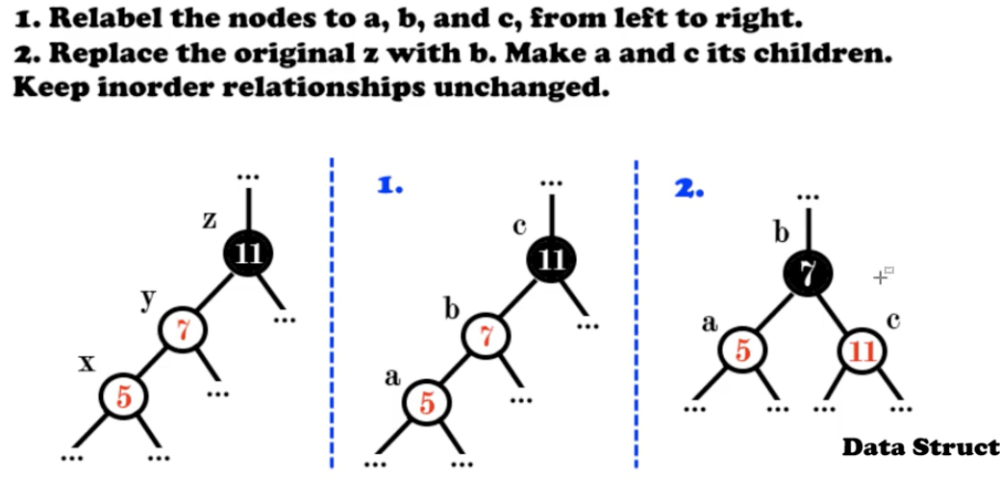

# Red Balck Trees

> Self-balancing binary search tree
>
> Each node has an extra bit, which represents its color(red or black)

- Root property : the root is black
- External property : Every external node is black.
- Red property : the children of a red node are black.
- Depth property : All external nodes have the same black depth.


- Searching In O(logn)
- Insertion in O(logn)
- Edletion in O(logn)

## Implementation

### 1. Insertion

> Insertion x
>
> if x is the first entry, add x to T and color it black Else replace the relevant external node with x anc color it red.
>
> https://www.youtube.com/watch?v=JwgeECkckRo

- In double red

  

  - Case 1 : s is black

    

  - Case 2 : s is red

    

- Intermediate Example


### Pseudocode


# 

### 2. Deletion

> Deletion node x from tree


 


- Delete 5

  

- Delete 10

  

  

  


- Delete 31

  

  

- Delete 7 and then 29

  


#### 


### Implementation by Python

```python
# Implementing Red-Black Tree in Python


import sys


# Node creation
class Node():
    def __init__(self, item):
        self.item = item
        self.parent = None
        self.left = None
        self.right = None
        self.color = 1


class RedBlackTree():
    def __init__(self):
        self.TNULL = Node(0)
        self.TNULL.color = 0
        self.TNULL.left = None
        self.TNULL.right = None
        self.root = self.TNULL

    # Preorder
    def pre_order_helper(self, node):
        if node != TNULL:
            sys.stdout.write(node.item + " ")
            self.pre_order_helper(node.left)
            self.pre_order_helper(node.right)

    # Inorder
    def in_order_helper(self, node):
        if node != TNULL:
            self.in_order_helper(node.left)
            sys.stdout.write(node.item + " ")
            self.in_order_helper(node.right)

    # Postorder
    def post_order_helper(self, node):
        if node != TNULL:
            self.post_order_helper(node.left)
            self.post_order_helper(node.right)
            sys.stdout.write(node.item + " ")

    # Search the tree
    def search_tree_helper(self, node, key):
        if node == TNULL or key == node.item:
            return node

        if key < node.item:
            return self.search_tree_helper(node.left, key)
        return self.search_tree_helper(node.right, key)

    # Balancing the tree after deletion
    def delete_fix(self, x):
        while x != self.root and x.color == 0:
            if x == x.parent.left:
                s = x.parent.right
                if s.color == 1:
                    s.color = 0
                    x.parent.color = 1
                    self.left_rotate(x.parent)
                    s = x.parent.right

                if s.left.color == 0 and s.right.color == 0:
                    s.color = 1
                    x = x.parent
                else:
                    if s.right.color == 0:
                        s.left.color = 0
                        s.color = 1
                        self.right_rotate(s)
                        s = x.parent.right

                    s.color = x.parent.color
                    x.parent.color = 0
                    s.right.color = 0
                    self.left_rotate(x.parent)
                    x = self.root
            else:
                s = x.parent.left
                if s.color == 1:
                    s.color = 0
                    x.parent.color = 1
                    self.right_rotate(x.parent)
                    s = x.parent.left

                if s.right.color == 0 and s.right.color == 0:
                    s.color = 1
                    x = x.parent
                else:
                    if s.left.color == 0:
                        s.right.color = 0
                        s.color = 1
                        self.left_rotate(s)
                        s = x.parent.left

                    s.color = x.parent.color
                    x.parent.color = 0
                    s.left.color = 0
                    self.right_rotate(x.parent)
                    x = self.root
        x.color = 0

    def __rb_transplant(self, u, v):
        if u.parent == None:
            self.root = v
        elif u == u.parent.left:
            u.parent.left = v
        else:
            u.parent.right = v
        v.parent = u.parent

    # Node deletion
    def delete_node_helper(self, node, key):
        z = self.TNULL
        while node != self.TNULL:
            if node.item == key:
                z = node

            if node.item <= key:
                node = node.right
            else:
                node = node.left

        if z == self.TNULL:
            print("Cannot find key in the tree")
            return

        y = z
        y_original_color = y.color
        if z.left == self.TNULL:
            x = z.right
            self.__rb_transplant(z, z.right)
        elif (z.right == self.TNULL):
            x = z.left
            self.__rb_transplant(z, z.left)
        else:
            y = self.minimum(z.right)
            y_original_color = y.color
            x = y.right
            if y.parent == z:
                x.parent = y
            else:
                self.__rb_transplant(y, y.right)
                y.right = z.right
                y.right.parent = y

            self.__rb_transplant(z, y)
            y.left = z.left
            y.left.parent = y
            y.color = z.color
        if y_original_color == 0:
            self.delete_fix(x)

    # Balance the tree after insertion
    def fix_insert(self, k):
        while k.parent.color == 1:
            if k.parent == k.parent.parent.right:
                u = k.parent.parent.left
                if u.color == 1:
                    u.color = 0
                    k.parent.color = 0
                    k.parent.parent.color = 1
                    k = k.parent.parent
                else:
                    if k == k.parent.left:
                        k = k.parent
                        self.right_rotate(k)
                    k.parent.color = 0
                    k.parent.parent.color = 1
                    self.left_rotate(k.parent.parent)
            else:
                u = k.parent.parent.right

                if u.color == 1:
                    u.color = 0
                    k.parent.color = 0
                    k.parent.parent.color = 1
                    k = k.parent.parent
                else:
                    if k == k.parent.right:
                        k = k.parent
                        self.left_rotate(k)
                    k.parent.color = 0
                    k.parent.parent.color = 1
                    self.right_rotate(k.parent.parent)
            if k == self.root:
                break
        self.root.color = 0

    # Printing the tree
    def __print_helper(self, node, indent, last):
        if node != self.TNULL:
            sys.stdout.write(indent)
            if last:
                sys.stdout.write("R----")
                indent += "     "
            else:
                sys.stdout.write("L----")
                indent += "|    "

            s_color = "RED" if node.color == 1 else "BLACK"
            print(str(node.item) + "(" + s_color + ")")
            self.__print_helper(node.left, indent, False)
            self.__print_helper(node.right, indent, True)

    def preorder(self):
        self.pre_order_helper(self.root)

    def inorder(self):
        self.in_order_helper(self.root)

    def postorder(self):
        self.post_order_helper(self.root)

    def searchTree(self, k):
        return self.search_tree_helper(self.root, k)

    def minimum(self, node):
        while node.left != self.TNULL:
            node = node.left
        return node

    def maximum(self, node):
        while node.right != self.TNULL:
            node = node.right
        return node

    def successor(self, x):
        if x.right != self.TNULL:
            return self.minimum(x.right)

        y = x.parent
        while y != self.TNULL and x == y.right:
            x = y
            y = y.parent
        return y

    def predecessor(self,  x):
        if (x.left != self.TNULL):
            return self.maximum(x.left)

        y = x.parent
        while y != self.TNULL and x == y.left:
            x = y
            y = y.parent

        return y

    def left_rotate(self, x):
        y = x.right
        x.right = y.left
        if y.left != self.TNULL:
            y.left.parent = x

        y.parent = x.parent
        if x.parent == None:
            self.root = y
        elif x == x.parent.left:
            x.parent.left = y
        else:
            x.parent.right = y
        y.left = x
        x.parent = y

    def right_rotate(self, x):
        y = x.left
        x.left = y.right
        if y.right != self.TNULL:
            y.right.parent = x

        y.parent = x.parent
        if x.parent == None:
            self.root = y
        elif x == x.parent.right:
            x.parent.right = y
        else:
            x.parent.left = y
        y.right = x
        x.parent = y

    def insert(self, key):
        node = Node(key)
        node.parent = None
        node.item = key
        node.left = self.TNULL
        node.right = self.TNULL
        node.color = 1

        y = None
        x = self.root

        while x != self.TNULL:
            y = x
            if node.item < x.item:
                x = x.left
            else:
                x = x.right

        node.parent = y
        if y == None:
            self.root = node
        elif node.item < y.item:
            y.left = node
        else:
            y.right = node

        if node.parent == None:
            node.color = 0
            return

        if node.parent.parent == None:
            return

        self.fix_insert(node)

    def get_root(self):
        return self.root

    def delete_node(self, item):
        self.delete_node_helper(self.root, item)

    def print_tree(self):
        self.__print_helper(self.root, "", True)


if __name__ == "__main__":
    bst = RedBlackTree()

    bst.insert(55)
    bst.insert(40)
    bst.insert(65)
    bst.insert(60)
    bst.insert(75)
    bst.insert(57)

    bst.print_tree()

    print("\nAfter deleting an element")
    bst.delete_node(40)
    bst.print_tree()


```

```JAVA
// Implementing Red-Black Tree in Java

class Node {
  int data;
  Node parent;
  Node left;
  Node right;
  int color;
}

public class RedBlackTree {
  private Node root;
  private Node TNULL;

  // Preorder
  private void preOrderHelper(Node node) {
    if (node != TNULL) {
      System.out.print(node.data + " ");
      preOrderHelper(node.left);
      preOrderHelper(node.right);
    }
  }

  // Inorder
  private void inOrderHelper(Node node) {
    if (node != TNULL) {
      inOrderHelper(node.left);
      System.out.print(node.data + " ");
      inOrderHelper(node.right);
    }
  }

  // Post order
  private void postOrderHelper(Node node) {
    if (node != TNULL) {
      postOrderHelper(node.left);
      postOrderHelper(node.right);
      System.out.print(node.data + " ");
    }
  }

  // Search the tree
  private Node searchTreeHelper(Node node, int key) {
    if (node == TNULL || key == node.data) {
      return node;
    }

    if (key < node.data) {
      return searchTreeHelper(node.left, key);
    }
    return searchTreeHelper(node.right, key);
  }

  // Balance the tree after deletion of a node
  private void fixDelete(Node x) {
    Node s;
    while (x != root && x.color == 0) {
      if (x == x.parent.left) {
        s = x.parent.right;
        if (s.color == 1) {
          s.color = 0;
          x.parent.color = 1;
          leftRotate(x.parent);
          s = x.parent.right;
        }

        if (s.left.color == 0 && s.right.color == 0) {
          s.color = 1;
          x = x.parent;
        } else {
          if (s.right.color == 0) {
            s.left.color = 0;
            s.color = 1;
            rightRotate(s);
            s = x.parent.right;
          }

          s.color = x.parent.color;
          x.parent.color = 0;
          s.right.color = 0;
          leftRotate(x.parent);
          x = root;
        }
      } else {
        s = x.parent.left;
        if (s.color == 1) {
          s.color = 0;
          x.parent.color = 1;
          rightRotate(x.parent);
          s = x.parent.left;
        }

        if (s.right.color == 0 && s.right.color == 0) {
          s.color = 1;
          x = x.parent;
        } else {
          if (s.left.color == 0) {
            s.right.color = 0;
            s.color = 1;
            leftRotate(s);
            s = x.parent.left;
          }

          s.color = x.parent.color;
          x.parent.color = 0;
          s.left.color = 0;
          rightRotate(x.parent);
          x = root;
        }
      }
    }
    x.color = 0;
  }

  private void rbTransplant(Node u, Node v) {
    if (u.parent == null) {
      root = v;
    } else if (u == u.parent.left) {
      u.parent.left = v;
    } else {
      u.parent.right = v;
    }
    v.parent = u.parent;
  }

  private void deleteNodeHelper(Node node, int key) {
    Node z = TNULL;
    Node x, y;
    while (node != TNULL) {
      if (node.data == key) {
        z = node;
      }

      if (node.data <= key) {
        node = node.right;
      } else {
        node = node.left;
      }
    }

    if (z == TNULL) {
      System.out.println("Couldn't find key in the tree");
      return;
    }

    y = z;
    int yOriginalColor = y.color;
    if (z.left == TNULL) {
      x = z.right;
      rbTransplant(z, z.right);
    } else if (z.right == TNULL) {
      x = z.left;
      rbTransplant(z, z.left);
    } else {
      y = minimum(z.right);
      yOriginalColor = y.color;
      x = y.right;
      if (y.parent == z) {
        x.parent = y;
      } else {
        rbTransplant(y, y.right);
        y.right = z.right;
        y.right.parent = y;
      }

      rbTransplant(z, y);
      y.left = z.left;
      y.left.parent = y;
      y.color = z.color;
    }
    if (yOriginalColor == 0) {
      fixDelete(x);
    }
  }

  // Balance the node after insertion
  private void fixInsert(Node k) {
    Node u;
    while (k.parent.color == 1) {
      if (k.parent == k.parent.parent.right) {
        u = k.parent.parent.left;
        if (u.color == 1) {
          u.color = 0;
          k.parent.color = 0;
          k.parent.parent.color = 1;
          k = k.parent.parent;
        } else {
          if (k == k.parent.left) {
            k = k.parent;
            rightRotate(k);
          }
          k.parent.color = 0;
          k.parent.parent.color = 1;
          leftRotate(k.parent.parent);
        }
      } else {
        u = k.parent.parent.right;

        if (u.color == 1) {
          u.color = 0;
          k.parent.color = 0;
          k.parent.parent.color = 1;
          k = k.parent.parent;
        } else {
          if (k == k.parent.right) {
            k = k.parent;
            leftRotate(k);
          }
          k.parent.color = 0;
          k.parent.parent.color = 1;
          rightRotate(k.parent.parent);
        }
      }
      if (k == root) {
        break;
      }
    }
    root.color = 0;
  }

  private void printHelper(Node root, String indent, boolean last) {
    if (root != TNULL) {
      System.out.print(indent);
      if (last) {
        System.out.print("R----");
        indent += "   ";
      } else {
        System.out.print("L----");
        indent += "|  ";
      }

      String sColor = root.color == 1 ? "RED" : "BLACK";
      System.out.println(root.data + "(" + sColor + ")");
      printHelper(root.left, indent, false);
      printHelper(root.right, indent, true);
    }
  }

  public RedBlackTree() {
    TNULL = new Node();
    TNULL.color = 0;
    TNULL.left = null;
    TNULL.right = null;
    root = TNULL;
  }

  public void preorder() {
    preOrderHelper(this.root);
  }

  public void inorder() {
    inOrderHelper(this.root);
  }

  public void postorder() {
    postOrderHelper(this.root);
  }

  public Node searchTree(int k) {
    return searchTreeHelper(this.root, k);
  }

  public Node minimum(Node node) {
    while (node.left != TNULL) {
      node = node.left;
    }
    return node;
  }

  public Node maximum(Node node) {
    while (node.right != TNULL) {
      node = node.right;
    }
    return node;
  }

  public Node successor(Node x) {
    if (x.right != TNULL) {
      return minimum(x.right);
    }

    Node y = x.parent;
    while (y != TNULL && x == y.right) {
      x = y;
      y = y.parent;
    }
    return y;
  }

  public Node predecessor(Node x) {
    if (x.left != TNULL) {
      return maximum(x.left);
    }

    Node y = x.parent;
    while (y != TNULL && x == y.left) {
      x = y;
      y = y.parent;
    }

    return y;
  }

  public void leftRotate(Node x) {
    Node y = x.right;
    x.right = y.left;
    if (y.left != TNULL) {
      y.left.parent = x;
    }
    y.parent = x.parent;
    if (x.parent == null) {
      this.root = y;
    } else if (x == x.parent.left) {
      x.parent.left = y;
    } else {
      x.parent.right = y;
    }
    y.left = x;
    x.parent = y;
  }

  public void rightRotate(Node x) {
    Node y = x.left;
    x.left = y.right;
    if (y.right != TNULL) {
      y.right.parent = x;
    }
    y.parent = x.parent;
    if (x.parent == null) {
      this.root = y;
    } else if (x == x.parent.right) {
      x.parent.right = y;
    } else {
      x.parent.left = y;
    }
    y.right = x;
    x.parent = y;
  }

  public void insert(int key) {
    Node node = new Node();
    node.parent = null;
    node.data = key;
    node.left = TNULL;
    node.right = TNULL;
    node.color = 1;

    Node y = null;
    Node x = this.root;

    while (x != TNULL) {
      y = x;
      if (node.data < x.data) {
        x = x.left;
      } else {
        x = x.right;
      }
    }

    node.parent = y;
    if (y == null) {
      root = node;
    } else if (node.data < y.data) {
      y.left = node;
    } else {
      y.right = node;
    }

    if (node.parent == null) {
      node.color = 0;
      return;
    }

    if (node.parent.parent == null) {
      return;
    }

    fixInsert(node);
  }

  public Node getRoot() {
    return this.root;
  }

  public void deleteNode(int data) {
    deleteNodeHelper(this.root, data);
  }

  public void printTree() {
    printHelper(this.root, "", true);
  }

  public static void main(String[] args) {
    RedBlackTree bst = new RedBlackTree();
    bst.insert(55);
    bst.insert(40);
    bst.insert(65);
    bst.insert(60);
    bst.insert(75);
    bst.insert(57);
    bst.printTree();

    System.out.println("\nAfter deleting:");
    bst.deleteNode(40);
    bst.printTree();
  }
}
```

