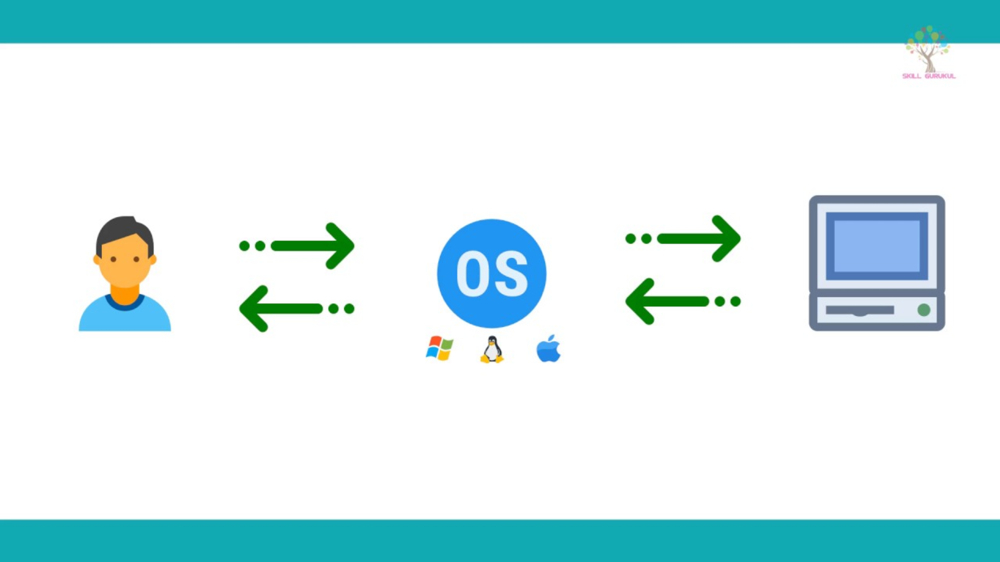

## 운영체제란?

- Operating System 또는 OS 라고 부름
- 대표적인 운영체제
  - Windows OS, Mac OS, 그리고 UNIX(유닉스) 
  - UNIX OS
    - UNIX 계열 OS
      - UNIX와 사용법이나, OS 구조가 유사
    - LINUX (리눅스) OS
      - 프로그래머, 전공자

------

## 운영체제 역할1: 시스템 자원(System Resource) 관리자

- 시스템 자원(System Resource) = 컴퓨터 하드웨어

------

## 운영체제 역할2: 사용자와 컴퓨터간의 커뮤니케이션 지원

------

## 운영체제 역할3: 응용프로그램 제어

------

## 정리[¶](https://www.fun-coding.org/whatisos.html#정리)

- 운영체제 역할1: 시스템 자원(System Resource) 관리자
- 운영체제 역할2: 사용자와 컴퓨터간의 커뮤니케이션 지원
- 운영체제 역할3: 응용 프로그램 제어

> 출처 : https://www.fun-coding.org/whatisos.html